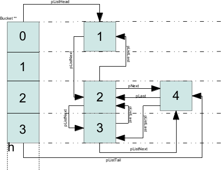
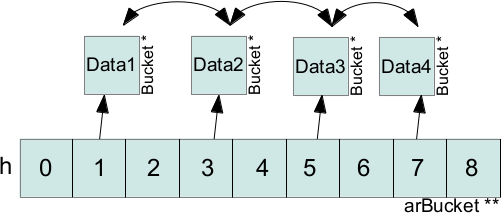

Basic structure
===============

Basic concepts
--------------

HashTables are at first a noticeable C structure designed to solve some data access problems. Basically, it's a C
pattern, like linked lists are, or trees: they solve a common problem providing a structure and an API. In C, you know
that arrays are just a manner of seeing and accessing adjacent regions of memory. So, C arrays are clearly fixed sized,
and typed. Very different from PHP arrays. How to implement PHP arrays in C? Hashtables are a solution.

But Hashtables are not just the internal design of PHP arrays, they are actually heavily used everywhere in PHP source
code, as this C structure is so useful in everyday C coding. The basics of HashTable is to store a value of any type,
into a structure, with the ability to look it up later in a reasonable amount of time, whatever the total number of
elements. The idea is to establish a mapping between the set of all possible keys and positions in the array using a
hash function. A hash function accepts a key and returns its hash value. Keys vary in type, but hash values are always
integers.

Since both computing a hash value and indexing into an array can be performed in constant time, the beauty of hashing is
that we can use it to perform constant-time searches. When a hash function can guarantee that no two keys will generate
the same hash value, the resulting hash table is directly addressed. This is ideal, but rarely possible in practice as
this would just lead to a too big C array. Typically, the number of entries in a hash table is small relative to the
universe of possible keys. Consequently, most hash functions map some keys to the same position in the table. When two
keys map to the same position, they collide. A good hash function minimizes collisions, but when they happen, a solution
should be found to deal with such a case.

Several solutions exists, one would be to use a double hash, another would be to use a doubly linked list to store item
at a same position in the hashtable. This latest solution is what is used in PHP: every time several input keys lead to
the same hash key, items are linked list behind the hash key. One should as well remember that the hashing function can
be CPU intensive. It wouldn't be a too big problem if you don't have to call it too often, but that's not the case in
PHP: we call the hash function very often, so it has both to produce good hashes, and to produce them very quickly. In
fact, the algorithm chosen by PHP is faster than safe, thought it still provides good distribution of keys, its own
performances are crucial for PHP and its engine.

HashTables in PHP
-----------------

PHP HashTables are one implementation of the global concept. They've been designed to fit PHP needs.
You can grab their API in ``zend_hash.c`` and ``zend_hash.h`` files. The basic structure is represented as follows::

    typedef struct _hashtable {
	    uint nTableSize;            /* Table size */
	    uint nTableMask;            /* Hash function mask */
	    uint nNumOfElements;        /* Number of items in the table */
	    ulong nNextFreeElement;     /* next item hash */
	    Bucket *pInternalPointer;   /* Pointer to current item */
	    Bucket *pListHead;          /* Pointer to head item */
	    Bucket *pListTail;          /* Pointer to tail item */
	    Bucket **arBuckets;         /* Items array */
	    dtor_func_t pDestructor;    /* destruction function */
	    zend_bool persistent;       /* Persistent allocation or not */
	    unsigned char nApplyCount;  /* Used to track recursion */
	    zend_bool bApplyProtection;
    #if ZEND_DEBUG
	    int inconsistent;
    #endif
    } HashTable;

Each item stored into the hashtable is represented as follows::

    typedef struct bucket {
	    ulong h;                        /* Hashed key */
	    uint nKeyLength;                /* Key size (only in case of string keys, 0 for integer type keys */
	    void *pData;                    /* Pointer to the real data */
	    void *pDataPtr;                 /* Real data */
	    struct bucket *pListNext;       /* Next item (bucket) in the table */
	    struct bucket *pListLast;       /* Previous item (bucket) in the table */
	    struct bucket *pNext;           /* Next item (bucket) in the linked list */
	    struct bucket *pLast;           /* Previous item in the linked list */
	    char *arKey;                    /* Key (if string key is used) */
    } Bucket;

``struct bucket``\s are stored into the ``arBuckets`` C array from the ``HashTable`` structure, and they are indexed
using the hashed key. As soon as the hash algorithm collides, two or more buckets would be stored at the same index,
thus overwriting themselves. This is fixed in PHP implementation of Hashtables by making a bucket doubly linked list.

Quick tips on understanding
***************************

At the time you insert its very first item, the HashTable will allocate memory for all future buckets, so that it
doesn't have to keep reallocating the ``arBuckets`` buffer at every insertion. The ``arBuckets`` array is fixed sized,
its size is rounded up to the next power of two of the true HashTable size. So for example, if you fill a PHP array with
say 12 elements, the underlining HashTable structure will be sized of 16, the arBuckets will be able to be indexed from
0 to 15. It surely can be resized, a PHP array is not fixed sized you know, in fact, every time you reach the HashTable
size limit, it's gonna be doubled. But keep in mind that resizing the table (growing it) has a cost as the hashed keys
depend on the table size (used as mask), so every time a resize occurs, every key is re-computed and passed through the
mask. You shouldn't worry about performance as masking is really fast on modern CPUs.

When deleting an item from the hashtable, a destruction function may be called on it, mainly to tidy-up allocated
memory. It then really makes sense to store into the hashtable the same C type as only one global destruction function
is attached to the table. Remember as well that the ``arBucket`` array will never shrink down: you can not reduce a PHP
array, you only can grow it.

When you want to insert an element into the table, you call for its API passing it your data and eventually the key
where you want to store it, the API will then take care of creating a ``Bucket`` object and store your data into it
using a ``void *`` pointer. If the data you pass to it is itself a pointer (and it will be in nearly every cases),
then the HashTable API will just get the address of your pointer and copy it into a ``Bucket``, then attaches the
``Bucket`` to the ``arBuckets`` array using the key you eventually provided together with your data to compute a C key
using the hash function and a mask.

If the key you provide is of integer type, then it will just be masked and used as the ``arBucket`` key. If you provide
a key of type ``char *``, then it will get into the hash function, will be masked, and then the resulting integer will
be used as the ``arBucket`` key. You will find more information about all this stuff in the last chapter where we show
edge cases.

HashTables API
==============

Here we will describe common use-cases regarding Hashtables API. If you want to have a deeper look at it, you should
then grab the sources which for hashtables implementation are not sparsed everywhere: just get zend_hash files from the
*Zend/* directory, and you are done.

Creating and destroying a hashtable
-----------------------------------

Guess what? Yep, we provide an API for allocating and freeing a hashtable. Better to use it::

    HashTable *myht;

    ALLOC_HASHTABLE(myht);

    zend_hash_init(myht, 10, NULL, NULL, (zend_bool)0);

So we allocate a hashtable for 10 items, the function will then round this up to the next power of 2: 16 in our case.
Both NULLs here are for a custom hashing function, we usually don't need and will use the default Zend one which is just
right, and for the destructor function, for this example we don't use any. The last parameter tells the allocator whether
we want or not a persistent allocation for this hashtable. Persistent allocations last after the request cycle and are
not freed by PHP before it shuts down. Most of the time, you'll need a request-life-allocated array.

Let's free this hashtable now::

    zend_hash_destroy(myht);
    FREE_HASHTABLE(myht);

``zend_hash_destroy()`` will take care of the housework for you, basicaly: iterate over the table, call the registered
destructor on all of them, then destroy the ``Bucket``. You are now about to free the HashTable, which
``FREE_HASHTABLE()`` takes care of.

As often the hashtable will carry ``zval *``, you should use ``zval_ptr_dtor()`` as a destructor function. The
signature of ``zval_ptr_dtor()`` is not compatible with what is expected by ``zend_hash_init()``, so whether you cast it
yourself, or use a special macro that takes care of that for you::

    HashTable *myht;
    ALLOC_HASHTABLE(myht);
    zend_hash_init(myht, 10, NULL, ZVAL_PTR_DTOR, (zend_bool)0);

``ZVAL_PTR_DTOR`` is a macro that just wraps ``zval_ptr_dtor()`` using correct casts so that your compiler wont shout
about incompatible types. Remember that ``zval_ptr_dtor()`` decrements the zval* refcount by one, and if it reaches
zero, frees it , so using it as a destructor in your hashtable is very nice as now the hashtables handles the cleaning
automatically about ``zval *``.

Just to let you know, should you clean a hashtable, aka empty all its items but leave itself alive,
``zend_hash_clean()`` will do the job. You will end up with a cleaned hashtable, just like if you just allocated it.

Playing with items, inserting and removing
------------------------------------------

Ok, now let's basically play with a hashtable. There are 3 things to remember every time you come to play with hashtables:
 * Whether the key is an integer or a string, the API call will always differ from both cases
 * Whether you already got a zval* to insert into the table, or you just would like the table to create it and insert it
   for you
 * If you want to use a string key, whether or not you already computed its hash using the hash function

So, remember this and we are done::

    HashTable *ht1 = NULL;
    ALLOC_HASHTABLE(ht1); /* allocate the table */

    zend_hash_init(ht1, 3, NULL, ZVAL_PTR_DTOR, 0); /* Prepare it to accept 3 elements, which you'll free using ZVAL_PTR_DTOR callback */

    zval *myval1, *myval2, *myval3 = NULL;
    MAKE_STD_ZVAL(myval1);MAKE_STD_ZVAL(myval2);MAKE_STD_ZVAL(myval3); /* allocate 3 zvals */

    ZVAL_STRING(myval1, "hello world", 1); /* a string */
    ZVAL_LONG(myval2, 42); /* a long */
    ZVAL_TRUE(myval3); /* a boolean */

    if (zend_hash_index_update(ht1, 12, (void *)&myval2, sizeof(zval *), NULL) == SUCCESS) { /* PHP: $array[12] = 42 */
        php_printf("Added zval myval2 to ht1 at index 12\n");
    }

    if (zend_hash_add(ht1, "str", sizeof("str"), (void *)&myval1, sizeof(zval *), NULL) == SUCCESS) { /* PHP: $array['str'] = 'hello world' */
        php_printf("Added zval myval1 to ht1 at index 'str' \n");
    }

    ulong key;
    /* Next numeric key, Should obviously be 13 here */
    key = zend_hash_next_free_element(ht1);
    if (zend_hash_next_index_insert(ht1, (void *)&myval3, sizeof(zval *), NULL) == SUCCESS) { /* PHP: $array[] = true */
        php_printf("Added zval myval3 to ht1 at index %ld \n", key);
    }

.. warning:: Be careful of the return type, it's not as you would expect 0/1, so, never write something like:
    ``if(zend_hash_add(/*...*/)) {`` but write: ``if(zend_hash_add(/*...*/) == FAILURE) {``. Always check against
    SUCCESS or FAILURE macros     when you use zend_hash API.

.. note:: You don't pass the ``zval *`` to the hashtable, but its address, becoming a ``zval **``.
   *HashTables always play one level of indirection above what you pass them*, so if you pass it, say, an ``int **``,
   it will play with an ``int ***``. We usually use ``zval *``, so it plays with ``zval *``.

As you can see, it's a little bit weird to insert zvals into a hashtable. Fortunately, there exists another API witch
goal is to create and allocate the zval for us, just pass its value and you are done. What is special about this API,
is that it doesn't play directly with a hashtable itself, but expect you to embed the Hashtable into a zval as well. The
API is so fully zval-turned, but under the hood it uses zend_hash API. Playing with the zval special API, our above
example then become something like that::

    zval *ht1 = NULL;
    ALLOC_INIT_ZVAL(ht1);
    array_init(ht1, 3);

    if (add_index_long(ht1, 12, 42) == SUCCESS) {
        php_printf("Added zval of type long (42) to ht1 at index 12\n");
    }

    if (add_assoc_string(ht1, "str", "hello world", 1) == SUCCESS) {
        php_printf("Added zval of type string ('hello world') to ht1 at index 'str' \n");
    }

    /* There does not exist something like add_next_index_bool() */

.. note:: Like we said, the API is different weither the key you provide is an integer (``ulong``), or a string
   (``char *``) or if you dont provide key at all and let the implementation choose the next one for you. Mainly
   "*assoc*" means string keys, and "*index*" means integer keys.

So, depending on the case, you'll choose to use directly the zend_hash API, or go with the zval ``add_`` API.

.. note:: Remember there is no problem having told the zend_hash API we would store 3 elements (using initialisation
   function) into it: it will round up our 3 to 4, and, if we would come to add more elements, it automatically
   internally resizes itself, we have nothing to do with that when using the API.

Retrieving, deleting and checking for items
-------------------------------------------

Now we can prepare a hashtable, and feed it with data, mainly zvals. What about looking for our data now? Or checking
whether they exist or not into the table? Let's go::

    HashTable *ht1 = NULL; ALLOC_HASHTABLE(ht1);

    zend_hash_init(ht1, 8, NULL, ZVAL_PTR_DTOR, 0);

    zval *myval; MAKE_STD_ZVAL(myval);
    ZVAL_STRING(myval, "hello world", 1); /* a string */

    if (zend_hash_index_update(ht1, 12, (void *)&myval, sizeof(zval *), NULL) == FAILURE) { /* add the value to index 12 */
        zend_error(E_ERROR, "Could not add value to the hashtable");
        zend_bailout();
    }

    zval **found = NULL;

    if (zend_hash_index_find(ht1, 12, (void **)&found) == SUCCESS) {
        php_printf("Hey, seems like there is something at numeric key 12, stored it into 'found' ");
        zend_hash_index_del(ht1, 12); /* Delete the item */
    }

Same thing as if you look for a value at an integer index, or a string index, you won't use the same API call. Also,
remember we added a ``zval **`` into the hashtable (the address of a ``zval *``), so, you have to provide the 'find'
function with a ``zval **``, and as it will have to write to it, you effectively end up passing a ``zval ***`` to
'find', as being the address of your ``zval **`` storage.

Should you just want to check for existence?

::

    if (zend_hash_index_exists(ht1, 12)) {
        /* Yes! */
    }

And if you deal with string type keys, the API becomes::

    if (zend_hash_exists(ht1, "fookey", sizeof("fookey"))) { /* Returns 1 or 0, no check against macro needed */
        /* Yes! */
    }

    zval **found = NULL;
    if (zend_hash_find(ht1, "fookey", sizeof("fookey"), (void **)&found) == SUCCESS) { /* Just to show the call */
        zend_hash_del(ht1, "fookey", sizeof("fookey")); /* Removing the item from the table */
    }

One last thing: if you need to get the current data pointed by the iterator, the API allows you to do so, like this::

    if (zend_hash_get_current_data(ht1, (void **)&found) == SUCCESS)  {
        /* Yes! */
    }

For the key, you first have to determine if it's a string or an int, then just use the correct argument, like this::

    int keytype, num_key;
    char *str_key = NULL;

    keytype = zend_hash_get_current_key(ht1, &str_key, &num_key, 0);

    switch (keytype) {
        case HASH_KEY_NON_EXISTANT:
            zend_error(E_NOTICE, "There is no current element in this array");
        break;
        case HASH_KEY_IS_INT:
            php_printf("Key was found!, it is an integer: %ld", num_key);
        break;
        case HASH_KEY_IS_STRING:
            php_printf("Key was found!, it is a string: '%s'", str_key);
        break;
        EMPTY_SWITCH_DEFAULT_CASE()
    }
    /* Just to let you know, we could have called zend_hash_get_current_key_type(ht1, &keytype); as well */

String keys and hashing algorithm
---------------------------------

You know when you use a string key. You know what happens to it when it dives into the zend_hash API call you perform:
it gets hashed by a hashing algorithm. This is a basic concept of hashtables we talked about in introduction chapter.
Let's see what the default hashing algo looks like::

    static inline ulong zend_inline_hash_func(const char *arKey, uint nKeyLength)
    {
	    register ulong hash = 5381;

	    /* variant with the hash unrolled eight times */
	    for (; nKeyLength >= 8; nKeyLength -= 8) {
		    hash = ((hash << 5) + hash) + *arKey++;
		    hash = ((hash << 5) + hash) + *arKey++;
		    hash = ((hash << 5) + hash) + *arKey++;
		    hash = ((hash << 5) + hash) + *arKey++;
		    hash = ((hash << 5) + hash) + *arKey++;
		    hash = ((hash << 5) + hash) + *arKey++;
		    hash = ((hash << 5) + hash) + *arKey++;
		    hash = ((hash << 5) + hash) + *arKey++;
	    }
	    switch (nKeyLength) {
		    case 7: hash = ((hash << 5) + hash) + *arKey++; /* fallthrough... */
		    case 6: hash = ((hash << 5) + hash) + *arKey++; /* fallthrough... */
		    case 5: hash = ((hash << 5) + hash) + *arKey++; /* fallthrough... */
		    case 4: hash = ((hash << 5) + hash) + *arKey++; /* fallthrough... */
		    case 3: hash = ((hash << 5) + hash) + *arKey++; /* fallthrough... */
		    case 2: hash = ((hash << 5) + hash) + *arKey++; /* fallthrough... */
		    case 1: hash = ((hash << 5) + hash) + *arKey++; break;
		    case 0: break;
    EMPTY_SWITCH_DEFAULT_CASE()
	    }
	    return hash;
    }

We won't explain it, simply recall what we said in intro: it leads to collisions, in some cases, but it is fast. Faster
enough for common use cases but there is a case where using it would be a pure waste: calling it with several times
the same argument. And this can happen quiet often, imagine you have a string key "mykey", if you happen to call any
zend_hash API with this key, all of them will call for the hash function, and it obviously will always lead to the same
hash result. This is a waste.

That's why the zend_hash API is nice about this as it can allow you to call for the hashing function, save the hash
somewhere, and everywhere in the future you could be tempted to use your string key "mykey", you know would be able to
reuse the hash you computed. Save CPU cycles, the idea is as easy as just not asking the CPU for doing several task the
exact same job.

Let's show this particular API you could need in your future developments::

    ulong my_hash = zend_get_hash_value("foobar", sizeof("foobar"));

    HashTable *ht1 = NULL; ALLOC_HASHTABLE(ht1); zend_hash_init(ht1, 2, NULL, ZVAL_PTR_DTOR, 0);

    zval *myval1 = NULL; MAKE_STD_ZVAL(myval1);
    ZVAL_STRING(myval1, "hello world", 1);

    if (zend_hash_quick_add(ht1, "foobar", sizeof("foobar"), my_hash, (void *)&myval1, sizeof(zval *), NULL) == SUCCESS) {
        php_printf("Added zval myval1 to ht1 at index 'str' \n");
    }

    if (zend_hash_quick_exists(ht1, "foobar", sizeof("foobar"), my_hash)) {
        php_printf("Just checked, our value is in! \n");
    }

    zend_hash_quick_del(ht1, "foobar", sizeof("foobar"), my_hash); /* Delete the value */

    if (zend_hash_quick_exists(ht1, "foobar", sizeof("foobar"), my_hash) == 0) {
        php_printf("Obviously, the value is not here any more\n");
    }

Wondering why, while passing the precomputed hash, we still need to pass the key string at every API call? Well it's
easy: because of collisions. There is no fact as "one string key = exactly one computed hash". Collisions can happen,
so the API will obviously use the precomputed hash we provided it, but it will always check for string equality as well
(``strcmp``), because it never can be sure that at this hash index, there is only our data with our string key. But, we
solved our problem here: we only triggered the hash algorithm once for all, and not for every API call we just
triggered.

Iterating over the table
------------------------

One more need you could meet about hashtables is to iterate over them. The zend_hash API provides all you need about
this, and it also provides ways to apply a callback to elements into hashtables. This is part of the next chapter,
first, let's concentrate on how to manually iterate over table items.

Basically, the iteration is just about remembering what the current position is, and this piece of information is stored
in the ``pInternalPointer`` field of the hashtable. However, it's *not recommended* to play with this internal position,
because the table you are iterating over may be shared somewhere else, and modifying its internal pointer could lead to
bugs elsewhere, where other functions wouldn't expect it to change. This is why the API allows you (and that's what
we'll always use) to iterate over a hashtable using an external position pointer, welcome the ``HashPosition`` type.

``HashPosition`` is just a typedef to Bucket \*, so it represents the current item, and passing a pointer to this
``HashPosition`` to every iteration-related functions will make them move it: you will iterate without changing the
internal HashTable position which is correct.

Let's show an example using all we've learned since the beginning of the chapter::

    HashTable *myht = NULL; ALLOC_HASHTABLE(myht); zend_hash_init(myht, 8, NULL, ZVAL_PTR_DTOR, 0);

    zval *array = NULL;
    ALLOC_ZVAL(array);
    array->type = IS_ARRAY;
    array->value.ht = myht;

    add_assoc_bool(array, "bool", 1);
    add_index_double(array, 1, 1.1);
    add_next_index_string(array, "hello world", 1);
    add_assoc_long(array, "the answer", 42);

    HashPosition mypos;
    zval **data = NULL;
    ulong longkey;
    char *strkey = NULL;
    zend_hash_internal_pointer_reset_ex(myht, &mypos); /* Pass mypos */

    while(zend_hash_has_more_elements_ex(myht, &mypos) == SUCCESS) {
        zend_hash_get_current_data_ex(myht, (void **)&data, &mypos);
        php_printf("At key ");
        switch (zend_hash_get_current_key_type_ex(myht, &mypos)) {
            case HASH_KEY_IS_LONG:
                zend_hash_get_current_key_ex(myht, &strkey, NULL, &longkey, 0, &mypos);
                php_printf("%ld", longkey);
            break;
            case HASH_KEY_IS_STRING:
                zend_hash_get_current_key_ex(myht, &strkey, NULL, &longkey, 0, &mypos);
                php_printf("'%s'", strkey);
            break;
        }
        zval *datacopy = NULL;
        copy_and_convert_to_string(*data, &datacopy);
        php_printf(", we have '%s' \n", Z_STRVAL_P(datacopy));
        zval_ptr_dtor(&datacopy);

        zend_hash_move_forward_ex(myht, &mypos);
    }
    zval_ptr_dtor(&array);

    /* Displays:
    At key 'bool', we have '1'
    At key 1, we have '1.1'
    At key 2, we have 'hello world'
    At key 'the answer', we have '42'
    */

Notice how we used the '_ex' alternative of functions we met before. All functions that deals with "_current_" values
or keys should *not* use the internal iterator pointer anymore like before, but the one we provide ourselves, called
here ``mypos``.

.. warning:: Remember to never modify a hashtable internal pointer. In a real life coding, things are shared, and the
   hashtable you'll be using will come from someone, to you, and be passed to someone else. Obviously one could expect
   the hashtable to now contain more or less items when passing into your hands, noone would expect its internal
   iteration pointer to have changed. Always use HashPosition, at least until you really know what you are doing.

Mapping functions
-----------------

HashAlgorithm and colliding the table
=====================================

Let's recall how all this works: When inserting a data, the (usually) provided key may be of two types: int or string.
If the key is a string, it then passes through the hash algorithm, which is *DJBX33A* in PHP, and an integer comes out
from this function. If the key were an integer, it is just used as-is. In both cases, we end up having a hash key with
an integer of type ``unsigned long`` (ulong), with no limit in its bounds. So we would need to allocate an array
(``arBuckets``) that should be referenced from 0 to ``sizeof(ulong)``, something like 18446744073709551615 on 64bits
platform, which is clearly impossible. The problem is that the actual hash key we computed is just too big and has no
bounds on the unsigned long range, it then cannot be used as-is as a C array index because the array would have been too
huge to fit in memory. What is then done as a second step, is that the hash key gets narrow-bounded, using a mask. The
mask cuts of the most significant bits in the integer, and dramatically lowers its space, making it suitable to be
passed as an index for a preallocated C array, ``arBuckets``. The mask is calculated as being the size of the HashTable
minus one. Here is the code for string typed keys::

    ht->nTableMask = ht->nTableSize - 1;
    void *p;

    h = zend_inline_hash_func(arKey, nKeyLength); /* Hash the arKey (char*) to get the hash key h (ulong) */

    nIndex = h & ht->nTableMask; /* Narrow h by masking its highest bits, obtain nIndex, an ulong from 0 to TableSize */

    p = ht->arBuckets[nIndex]; /* Use the nIndex to get back p (Bucket*) from the bucket array arBuckets */
    /* Use p here */

We said that if the provided key is of type integer (``ulong``) and not string (``char *``), we just don't need to run
the hash function. Code then becomes::

    ht->nTableMask = ht->nTableSize - 1;
    void *p;

    h = provided_key /* of type ulong */

    nIndex = h & ht->nTableMask; /* Narrow h by masking its highest bits, obtain nIndex, a ulong from 0 to TableSize */

    p = ht->arBuckets[nIndex]; /* Use the nIndex to get back p (Bucket*) from the bucket array arBuckets */
    /* Use p here */

What this means is that if you build a special PHP array, with only integer keys, that when used with the mask give
always the same index, then you will overcollide the array, and end-up having a possibly too huge linked list.
Traversing a linked list is O(n), so the more the linked list grows, the slower it becomes to traverse it. Knowing that the
API has to traverse the lists at every lookup or insertion (which triggers a lookup) in the table, it is then easy to
DOS this part of PHP.

To show this, let's build a use case and explain it:

.. code-block:: php

    <?php
    /* 2^15, for example, any power of 2 works */
    $size = 32768;
    $startTime = microtime(1);

    $array     = array();
    $maxInsert = $size * $size;

    for ($key = 0; $key <= $maxInsert; $key += $size) {
        $array[$key] = 0;
    }

    printf("%d inserts in %.2f seconds", $key/$size, microtime(1)-$startTime);

Running this code, you should obtain something like 32769 insertions in 9.84 seconds, which is just a very huge amount
of time. Let's now explain what happens at a lower level. We know that using a key as an integer, no hashing function
comes to play, so the code being run to compute the C array key (``nIndex``) mainly looks like::

    nIndex = h & ht->nTableMask; /* masking */
    p = ht->arBuckets[nIndex];

We know that ``nTableMask`` is table size minus one. As the key is added 32768 (2 powered by 15) at each step of the for
loop, it jumps from bit to bit, and the mask is just irrelevant:

.. code-block:: none

    for ($key = 0; $key <= $maxInsert; $key += $taille) {
        $array[$key] = 0;
    }

    mask:   0000.0111.1111.1111.1111
                     &
    32768   0000.1000.0000.0000.0000
    65536   0001.0000.0000.0000.0000
    98304   0001.1000.0000.0000.0000
    131072  0010.0000.0000.0000.0000
    163840  0010.1000.0000.0000.0000
    ...
                 = 0 !

We end up inserting every item (we insert 32769 total items) at the same ``arBuckets`` index: 0. Every item is then
added to the linked list sitting at index 0 of ``arBuckets``, and traversing a fast growing linked list takes so much
time. Be convinced by breaking this actual collision-proof code, just use a size of 32767 for example, instead of the
special 32768. You will get something like 32768 inserts in 0.01 seconds, which is about 1000 times faster.

When the hash algorithm + the hash mask works normally, meaning we are not cheating them voluntary like we did, it
distributes pretty well buckets into the ``arBuckets``:

When it's not the case, you end with something like this, which we could call the 'worst scenario':

.. image:: ./images/hash_distribution_ko.png

Use cases
=========
