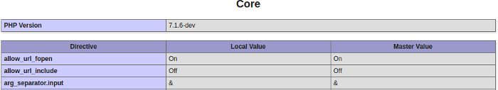

Declaring and using INI settings
================================

This chapter details how PHP plays with its configuration and how an extension is expected to hook into the main
configuration step of PHP, by registering and making use of INI settings.

Reminders on INI settings
-------------------------

Before going further, you must remember how INI settings and PHP configuration work in PHP. Here are the steps, once
more extracted as an interpretation of the source code. PHP INI file parsing steps happen in
`php_init_config() <https://github.com/php/php-src/blob/4903f044d3a65de5b1c457d9eb618c9e247f7086/main/php_ini.c#L382>`_,
and everything related to INI mainly takes place in
`Zend/zend_ini.c <https://github.com/php/php-src/blob/4903f044d3a65de5b1c457d9eb618c9e247f7086/Zend/zend_ini.c>`_.

First, PHP tries to parse one or several INI files. Those files may declare some settings, that may or may not be
relevant in the future. At this very early stage (INI files parsing), PHP knows nothing about what to expect in such
files. It just parses the content, and saves this one for later use.

Then as a second step, PHP boots up its extensions, calling their ``MINIT()``. If you need to remember about the PHP
lifecycle, :doc:`read the dedicated chapter <php_lifecycle>`. ``MINIT()`` may now register the current
extension INI settings of interest. When registering the setting, the engine checks if it parsed its definition before,
as part of the INI files parsing step. If that was the case, then the INI setting is registered into the engine and it
gets the value that was parsed from INI files. If it had no definition in INI files parsed, then it gets registered with
the default value the extension designer gives to the API.

.. note:: The default value the setting will get is probed from INI files parsing. If none is found, then the default
          is the one given by the extension developer, not the other way around.

The default value we are talking about here is called the **"master value"**. You may recall it from a ``phpinfo()``
output, right ?

The master value cannot change. If during a request, the user wants to change the configuration, f.e using
``ini_set()``, and if he's allowed to, then the changed value will be the **"local value"** , that is the current value
for the current request. The engine will automatically restore the local value to the master value at the end of
the request, thus resetting it and forgetting about request-live changes.

``ini_get()`` reads the current request-bound local value, whereas ``get_cfg_var()`` will read the master value
whatever happens.

.. note:: If you have understood correctly, ``get_cfg_var()`` will return false for any value asked that was not part of
          INI file parsing, even if the value exists and was declared by an extension.
          And the opposite is true: ``ini_get()`` will return false if asked for a setting that no extension has declared
          interest in, even if such a setting was part of an INI file parsing (like php.ini).

Zoom on INI settings
--------------------

Into the engine, an INI setting is represented by a ``zend_ini_entry`` structure::

    struct _zend_ini_entry {
        zend_string *name;
        int (*on_modify)(zend_ini_entry *entry, zend_string *new_value, void *mh_arg1, void *mh_arg2, void *mh_arg3,
                         int stage);
        void *mh_arg1;
        void *mh_arg2;
        void *mh_arg3;
        zend_string *value;
        zend_string *orig_value;
        void (*displayer)(zend_ini_entry *ini_entry, int type);
        int modifiable;

        int orig_modifiable;
        int modified;
        int module_number;
    };

Nothing really strong in such a structure.

* Setting's ``name`` and ``value`` are the most commonly used fields. Note
  however that the value is a string (as :doc:`zend_string *<../internal_types/strings/zend_strings>`) and nothing else.
* Then, like we detailed in the introduction chapter above, we find the ``orig_value``, ``orig_modified``, ``modifiable``
  and ``modified`` fields which are related to the modification of the setting's value. The setting must keep in memory
  its original value (as "master value").
* ``modifiable`` tells if the setting is actually modifable, and must pick some
  values from ``ZEND_INI_USER``, ``ZEND_INI_PERDIR``, ``ZEND_INI_SYSTEM`` or
  ``ZEND_INI_ALL``, those may be flagued together and are detailed `in the PHP manual
  <http://php.net/configuration.changes.modes>`_.
* ``modified`` is set to one anytime the setting has been modified during a request so that the engine knows at request
  shutdown that it must restore that INI setting value to its master value for the next request to treat.
* ``on_modify()`` is a handler called whenever the current setting's value is modified, like f.e using a call
  to ``ini_set()`` (but not only). We'll focus deeper on ``on_modify()`` later, but think of it as being a
  *validator function* (f.e if the setting is expected to represent an integer, you may validate the values you'll be
  given against integers). It also serve as a memory bridge to update global values, we'll get back on that later as
  well.
* ``diplayer()`` is less useful, and you usually don't pass any. ``displayer()`` is about how to display your setting.
  F.e, you may remember that PHP tends to display *On* for boolean values of *true*/*yes*/*on*/*1* etc. That's the
  ``displayer()`` job : turn the current value into a "displayed" value.

You will also need to deal with this structure ``zend_ini_entry_def``::

    typedef struct _zend_ini_entry_def {
        const char *name;
        ZEND_INI_MH((*on_modify));
        void *mh_arg1;
        void *mh_arg2;
        void *mh_arg3;
        const char *value;
        void (*displayer)(zend_ini_entry *ini_entry, int type);
        int modifiable;

        uint name_length;
        uint value_length;
    } zend_ini_entry_def;

Pretty much similar to ``zend_ini_entry``, ``zend_ini_entry_def`` is used by the programmer (you) when he must register
an INI setting against the engine. The engine reads a ``zend_ini_entry_def``, and creates internally a
``zend_ini_entry`` for its own usage, based on the definition model you provide. Easy.

Registering and using INI entries
---------------------------------

Registration
************

INI settings are persistent through requests. They may change their value at runtime during a request, but they'll go back
to original value at request shutdown. Thus, registering INI settings is done once for all, in ``MINIT()`` hook of your
extension.

What you must do is declare a vector of ``zend_ini_entry_def``, you'll be helped with dedicated macros for that. Then,
you register your vector against the engine and you are done for the declaration. Let's see that with our example taken
for previous chapter about random number picking and guessing, once again only showing relevant parts for now::

    PHP_INI_BEGIN()
    PHP_INI_ENTRY("pib.rnd_max", "100", PHP_INI_ALL, NULL)
    PHP_INI_END()

    PHP_MINIT_FUNCTION(pib)
    {
        REGISTER_INI_ENTRIES();

        return SUCCESS;
    }

    PHP_MINFO_FUNCTION(pib)
    {
        DISPLAY_INI_ENTRIES();
    }

    PHP_MSHUTDOWN_FUNCTION(pib)
    {
        UNREGISTER_INI_ENTRIES();

        return SUCCESS;
    }

That was the easiest INI declaration, we won't keep it as-is but the steps are trivial : you declare a
``zend_ini_entry_def[]`` vector using ``PHP_INI_BEGIN`` and ``PHP_INI_END`` macros. In the middle, you add your
individual ``zend_ini_entry_def`` entries using here again macros. We used the simplest one : ``PHP_INI_BEGIN()``, that
takes only four parameters : the name of the entry to register, its default value given if it was not part of an INI
file scanning (see above chapter for details), the modification level, ``PHP_INI_ALL`` says "everywhere". We did not
play with validator yet, and passed NULL.

In ``MINIT`` hook , we use the ``REGISTER_INI_ENTRIES`` macro which does its describing job whereas its counter-part
``UNREGISTER_INI_ENTRIES`` is used at module shutdown to free the allocated resources.

Now, the new *"pib.rnd_max"* INI setting is declared - as ``PHP_INI_ALL`` - that means that the user may modify its
value using ``ini_set()`` (and read it back with ``ini_get()``).

We did not forget to display those INI settings as part of our extension information, using ``DISPLAY_INI_ENTRIES()``.
Forgetting this in the declaration of the ``MINFO()`` hook will lead to our INI settings being hidden from the user in
the information page (``phpinfo()``). Have a look at the :doc:`extension information chapter <extension_infos>` if
you need.

Usage
*****

On your part as extension developer, we may now need to read INI settings values by yourself. The simplest way to do
this into your extension is to use macros that will look for the value into the main array retaining all the INI
settings, find it, and return it as the type you'll ask for. We are provided several macros depending on what C type
we want to be given back.

``INI_INT(val)``, ``INI_FLT(val)``, ``INI_STR(val)``, ``INI_BOOL(val)`` all four macros will look for the provided
value from the INI settings array and return it (if found) with a cast to the type you ask.

.. note:: Remember that into ``zend_ini_entry``, the value is a ``zend_string`` type. For our example, we registered an
          INI setting of type 'long', our ``pib.rnd_max`` which default value is 100. But that one's value is registered
          as a ``zend_string`` into the INI settings array, and thus needs to be casted to a 'long' every time we want
          to read its value back. ``INI_INT()`` does such a job.

Example::

    php_printf("The value is : %lu", INI_INT("pib.rnd_max"));

.. note:: If the value is not found, 0 is returned as we asked for a long. 0.0 would have been returned in the same
          case, but about a float conversion, etc.

If the user would have modified the setting, and we would have wanted to display the "master" original value (in our
case : 100), then we would have used ``INI_ORIG_INT()`` instead of ``INI_INT()``. Of course, such declinations macros
also exist for other types.

Validators and globals memory bridge
------------------------------------

So far so good, registering and reading back INI settings values is not really hard. But the way we used them in the
previous above lines is far from being optimal.

There are two problems that will get solved at the same time by using the 'advanced' INI settings API :

* Every time we want to read our value, a lookup into the main INI settings table is needed, as well as a cast to the
  right type (often). Those operations cost some CPU cycles.
* We did not provide any validator, thus the user could alter our setting and put anything he wants to as a value.

The solution is to use an ``on_modify()`` validator and a memory bridge to update a global variable.

By using the advanced INI settings management API, we can tell the engine to register our settings just normally, but
we can also instruct it to update a global of our taste every time the INI setting value is changed. Hence, whenever we
will want to read back our value, we'll just need to read our global. This will provide a boost in performance in the
case we need to read the INI setting value often, as a hashtable lookup and a cast operation won't be needed anymore.

.. note:: You will need to feel comfortable with globals to continue reading the chapter. Global space management is
          treated :doc:`into its own chapter <globals_management>`.

To declare a memory bridge to a global, we need to create a request global, and to change the way our INI setting was
declared. Like this::

    ZEND_BEGIN_MODULE_GLOBALS(pib)
        zend_ulong max_rnd;
    ZEND_END_MODULE_GLOBALS(pib)

    ZEND_DECLARE_MODULE_GLOBALS(pib)

    PHP_INI_BEGIN()
        STD_PHP_INI_ENTRY("pib.rnd_max", "100", PHP_INI_ALL, OnUpdateLongGEZero, max_rnd, zend_pib_globals, pib_globals)
    PHP_INI_END()

    PHP_MINIT_FUNCTION(pib)
    {
        REGISTER_INI_ENTRIES();

        return SUCCESS;
    }

We declare a global named ``max_rnd``, of type ``zend_ulong``. Then, we register our *'pib.rnd_max'* INI value using
``STD_PHP_INI_ENTRY()`` this time. That allows us to pass more parameters to the macro. The first four ones are known,
we detailed them before in the chapter.

The four last parameters represent the globals bridge. We tell that we want to update ``max_rnd``, in the
``zend_pib_globals`` structure represented by the symbol ``pib_globals``. Read the
:doc:`global management chapter <globals_management>` if not comfortable. As a quick reminder,
``ZEND_BEGIN_MODULE_GLOBALS()`` declares the ``zend_pib_globals`` structure, and ``ZEND_DECLARE_MODULE_GLOBALS()``
declares a ``pib_globals`` symbol of such a type.

.. note:: Internally, `offsetof <https://en.wikipedia.org/wiki/Offsetof>`_ will be used to compute the bytes slice of our
          ``max_rnd`` member into the ``zend_pib_globals`` structure, to be able to update that part of memory whenever the
          *'pib.rnd_max'* will get changed.

The ``on_modify()`` validator used here, ``onUpdateLongGEZero()``, is a default validator that exists in PHP and
validates the value against a long greater than or equal to zero. The validator is needed for the global to be updated,
as such a job is done into the validator.

Now, to read back our INI setting value, we just need to read the value of our ``max_rnd`` global::

    php_printf("The value is : %lu", PIB_G(max_rnd));

And we are done.

Let's go to see the validator now (``on_modify()`` handler). The validator has two goals :

* Validate the passed value
* Update the global if the validation succeeds

The validator is only called when the INI setting is set or modified (written to), whenever this step happens.

.. warning:: If you want the global variable to be updated with the INI setting value, you'll need a validator. Such a
             mechanism is not magicaly performed by the engine, but must be done explicitly into the validator.

Let's see the ``onUpdateLongGEZero()`` source code::

    #define ZEND_INI_MH(name) int name(zend_ini_entry *entry, zend_string *new_value,
                                        void *mh_arg1, void *mh_arg2, void *mh_arg3, int stage)

    ZEND_API ZEND_INI_MH(OnUpdateLongGEZero)
    {
        zend_long *p, tmp;
    #ifndef ZTS
        char *base = (char *) mh_arg2;
    #else
        char *base;

        base = (char *) ts_resource(*((int *) mh_arg2));
    #endif

        tmp = zend_atol(ZSTR_VAL(new_value), (int)ZSTR_LEN(new_value));
        if (tmp < 0) {
            return FAILURE;
        }

        p = (zend_long *) (base+(size_t) mh_arg1);
        *p = tmp;

        return SUCCESS;
    }

Like you can see, there is nothing complex. Your validator is given the ``new_value`` and must validate against it.
Remember that ``new_value`` is of type :doc:`zend_string * <../internal_types/strings/zend_strings>`. The
``onUpdateLongGEZero()`` takes the value as a long and checks if it is a positive integer. One must return ``SUCCESS``
from the validator if everything went right and ``FAILURE`` if not.

Then comes the part to update the global. ``mh_arg`` variables are used to carry any type of information to your
validator.

.. note:: *'mh'* stands for *modify handler*. Validators callbacks are also called *modification handler callbacks*.

``mh_arg2`` is a pointer to the memory area representing the beginning of your global structure memory, in our case, the
beginning of the ``pib_globals`` allocated memory. Note that as we talk about request-global variable memory, that latter
is accessed differently if you are using ZTS mode or not. More information about ZTS
:doc:`can be found here <globals_management>`.

``mh_arg1`` is passed the computed offset of your global member (``max_rnd`` for us), and you must slice the memory
yourself to get a pointer to it. That's why we stored ``mh_arg2`` as a generic ``char *`` pointer and casted
``mh_arg1`` to ``size_t``.

Then, you simply update the content with the validated value by writing into the pointer. ``mh_arg3`` is unused actually.

Default validators from PHP are ``OnUpdateLongGEZero()``, ``OnUpdateLong()``, ``OnUpdateBool()``, ``OnUpdateReal()``,
``OnUpdateString()``, and ``OnUpdateStringUnempty()``. Their names are self describing and their source code as well
(you may read it).

Based on such a model, we could develop our own validator, that validates against a positive integer between 0 and 1000
for example::

    ZEND_INI_MH(onUpdateMaxRnd)
    {
        zend_long tmp;

        zend_long *p;
    #ifndef ZTS
        char *base = (char *) mh_arg2;
    #else
        char *base;

        base = (char *) ts_resource(*((int *) mh_arg2));
    #endif

        p = (zend_long *) (base+(size_t) mh_arg1);

        tmp = zend_atol(ZSTR_VAL(new_value), (int)ZSTR_LEN(new_value));

        if (tmp < 0 || tmp > 1000) {
            return FAILURE;
        }

        *p = tmp;

        return SUCCESS;
    }

    PHP_INI_BEGIN()
        STD_PHP_INI_ENTRY("pib.rnd_max", "100", PHP_INI_ALL, onUpdateMaxRnd, max_rnd, zend_pib_globals, pib_globals)
    PHP_INI_END()

.. note:: It is safe to write to an *unsigned long* from a *long*, as soon as the ranges are checked, which the validator
          does.

Now, if the user wants to modify the setting and pass a wrong value that does not validate, ``ini_set()`` simply will
return false to the userland, and will not modify the value:

.. code-block:: php

    ini_set('pib.rnd_max', 2048); /* returns false as 2048 is > 1000 */

In the opposite case, ``ini_set()`` returns the old value and modifies current the value. The new provided value becomes
 the current "local" value whereas the default preceding value stays as the "master value". ``phpinfo()`` or
 ``ini_get_all()`` detail such values. Example:

.. code-block:: php

    ini_set('pib.rnd_max', 500);

    var_dump(ini_get_all('pib'));

    /*
    array(1) {
      ["pib.rnd_max"]=>
      array(3) {
        ["global_value"]=>
        string(3) "100"
        ["local_value"]=>
        string(3) "500"
        ["access"]=>
        int(7)
      }
    */

Be advised that your validator callback will be called anytime the value is changed, and it is changed several times.
For example, for our tiny example, the validator we designed is called three times :

* Once in ``REGISTER_INI_ENTRY()``, in ``MINIT()``. We set the default value to our setting here, hence this is done
  using our validator. Remember that the default value could come from INI files parsing.
* Once per ``ini_set()`` userland call.
* Once in ``RSHUTDOWN()``, when the engine will attempt to restore the local value to its master value, if the value has
  been changed during the current request. Userland ``ini_restore()`` does the same job.

Keep also in mind that the value accessor is checked against by ``ini_set()``. If we would have designed a
``PHP_INI_SYSTEM`` setting, then the user would not have been able to modify it using ``ini_set()``, as ``ini_set()``
uses ``PHP_INI_USER`` as accessor. The mismatch would then have been detected and the validator would not have
been called by the engine in such a case.

If you need to change the INI setting value into your extension at runtime, the internal call is
``zend_alter_ini_entry()``, this is what userland ``ini_set()`` uses.

Using a displayer
-----------------

The last thing you need to know about INI settings is the ``displayer()`` callback. It is less used in practice, it is
triggered any time the userland asks to "print" your INI setting value, that is through the usage of
``phpinfo()`` or ``php --ri``.

If you provide no displayer, a default one will be used. See it::

    > php -dextension=pib.so -dpib.rnd_max=120 --ri pib

    Directive => Local Value => Master Value
    pib.rnd_max => 120 => 120

The default displayer takes the INI setting value (which, as a reminder, is of type ``zend_string *``), and simply
displays it. If no value were found or the value were the empty string, then it displays the string "no value".

To take hand on such a process, we must declare a ``displayer()`` callback that will be called. Let's try to represent
our *'pib.rnd_max'* value as a percentage bar, with *'#'* and *'.'* chars. Just an example::

    #define ZEND_INI_DISP(name) void name(zend_ini_entry *ini_entry, int type)

    ZEND_INI_DISP(MaxRnd)
    {
        char disp[100] = {0};
        zend_ulong tmp = 0;

        if (type == ZEND_INI_DISPLAY_ORIG && ini_entry->modified && ini_entry->orig_value) {
            tmp = ZEND_STRTOUL(ZSTR_VAL(ini_entry->orig_value), NULL, 10);
        } else if (ini_entry->value) {
            tmp = ZEND_STRTOUL(ZSTR_VAL(ini_entry->value), NULL, 10);
        }

        tmp /= 10;

        memset(disp, '#', tmp);
        memset(disp + tmp, '.', 100 - tmp);

        php_write(disp, 100);
    }

    PHP_INI_BEGIN()
        STD_PHP_INI_ENTRY_EX("pib.rnd_max", "100", PHP_INI_ALL, onUpdateMaxRnd, max_rnd, zend_pib_globals,
                              pib_globals, MaxRnd)
    PHP_INI_END()

We use this time the ``_EX()`` macro counter-part to declare our INI setting. This macro accepts as last parameter the
displayer function. ``STD_PHP_INI_ENTRY_EX()`` is then used.

``ZEND_INI_DISP()`` is then used to declare our displayer function. It receives as argument the INI setting it's been
attached to, and the value PHP wants you to display : ``ZEND_INI_DISPLAY_ORIG`` means the master value, and
``ZEND_INI_DISPLAY_ACTIVE`` means the current request-bound local value.

Then we toy with the value, and represent it as '#' and '.' chars, something like this:

.. code-block:: php

    ini_set('pib.rnd_max', 500);
    phpinfo(INFO_MODULES);

If we invoke it with::

    > php -dextension=pib.so /tmp/file.php

Then it displays::

    pib

    Directive => Local Value => Master Value
    pib.rnd_max => ##################################################..................................................
                => ##########..........................................................................................

And if we invoke it with::

    > php -dextension=pib.so -dpib.rnd_max=10 /tmp/file.php

Then it displays::

    pib

    Directive => Local Value => Master Value
    pib.rnd_max => ##################################################..................................................
                => ....................................................................................................

As PHP will display both our local and master value, our displayer callback will be called twice here. The local value
is effectively representing the value of "500" whereas the master value shows the default hardcoded value of "100"
if we don't change it, and if we change it using ``-d`` from php-cli, it is effectively used.

If you want to use one of the existing displayers from PHP, you may use ``zend_ini_boolean_displayer_cb()``,
``zend_ini_color_displayer_cb()`` or ``display_link_numbers()``
