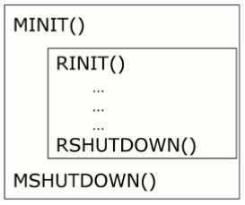
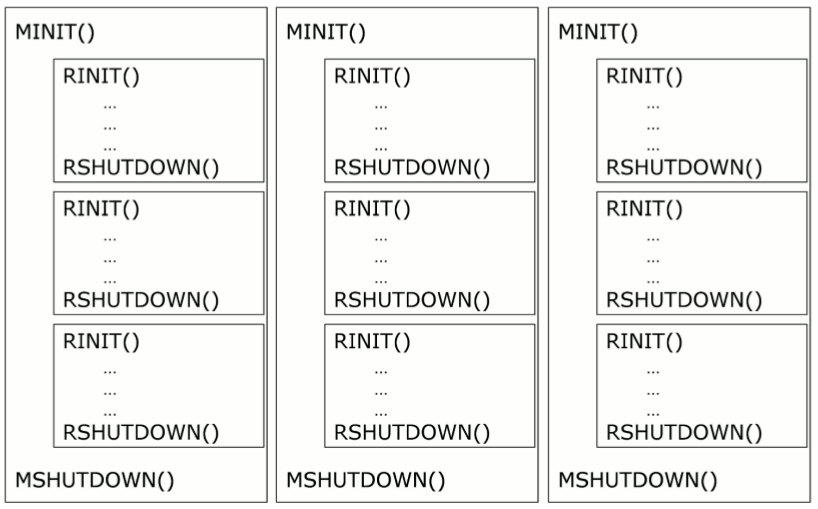
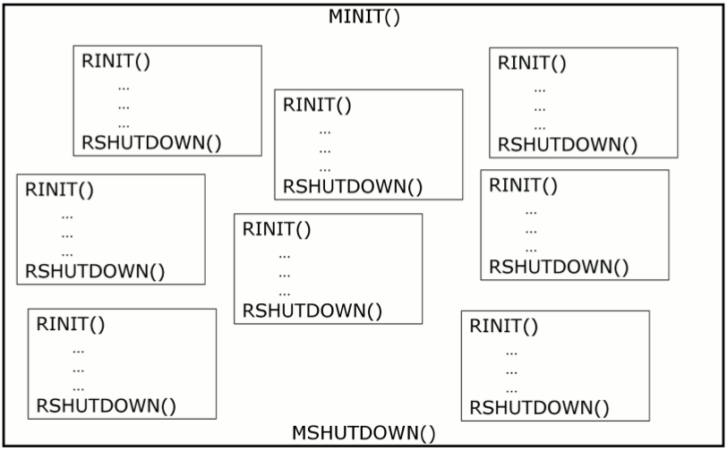
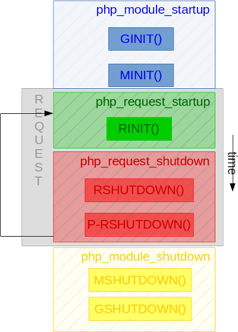

Learning the PHP lifecycle
==========================

PHP's a complex machinery which lifecycle should really be mastered by anyone pretending to hook into it.
The main line is as follow :

PHP starts up. If running CLI or FPM, it's C ``main()`` is run. If running as a module into a webserver, like using the 
apxs2 SAPI (Apache 2), PHP is started up just a little bit after Apache itself starts up and comes to run the startup 
sequence of its module which PHP is one. Starting up, is called internally **the module startup step**. We also 
abbreviate it as the **MINIT** step.

Once started, PHP waits to treat one/several requests. When we talk about PHP CLI, there will be only one request: the 
current script to run. However, when we talk about a web environment- should it be thought as PHP-FPM or webserver 
module- PHP could serve several requests one after the other. It all depends on how you did configure you webserver: 
you may tell it to serve an infinite number of requests, or a specific number before shutting down and recycling the 
process. Everytime a new request shows in to be treated, PHP will run **a request startup step**. We call it the 
**RINIT**.

The request is served, some content is (probably) generated, OK. Time to shutdown the request and get prepared to 
eventually treat another one. Shutting down a request is called **the request shutdown step**.

After having treated X requests (one, several dozens, thousands etc..), PHP will finally shut down itself, and die.
Shutting down the PHP process is called **the module shutdown step**. We abbreviate it as **MSHUTDOWN**.

If we would have drawn those steps, that could give something like this:

The parallelism models
**********************

In a CLI environment, everything is easy : one PHP process will treat one request : it will launch one solo PHP script, 
then die.
The CLI environment is a specialization of the Web environment, which is more complex.

To treat several requests at the same time, you need to run a parallelism model. There exists two of them in PHP:

* The process-based model
* The thread-based model

Using the process-based model, every PHP interpreter is isolated by the OS into its own process.
This model is very common under Unix. Every request leaves into its own process.

With the thread-based model, every PHP interpreter is isolated into a thread, using a thread library.
This model is mainly used under Microsoft Windows OS, but can be used with most Unixes as well.

Here is the process-based model:

And here is the thread-based model:

The PHP extensions hooks
************************

As you could have guessed, the PHP engine will trigger your extension at several lifetime points. We call those hook 
functions. Your extension may declare interest into specific lifetime points by declaring function hooks while it 
registers against the engine.

Those hooks can clearly be felt once you analyze a PHP extension structure, the ``zend_module_entry`` structure::

    struct _zend_module_entry {
	    unsigned short size;
	    unsigned int zend_api;
	    unsigned char zend_debug;
	    unsigned char zts;
	    const struct _zend_ini_entry *ini_entry;
	    const struct _zend_module_dep *deps;
	    const char *name;
	    const struct _zend_function_entry *functions;
	    int (*module_startup_func)(INIT_FUNC_ARGS);        /* MINIT() */
	    int (*module_shutdown_func)(SHUTDOWN_FUNC_ARGS);   /* MSHUTDOWN() */
	    int (*request_startup_func)(INIT_FUNC_ARGS);       /* RINIT() */
	    int (*request_shutdown_func)(SHUTDOWN_FUNC_ARGS);  /* RSHUTDOWN() */
	    void (*info_func)(ZEND_MODULE_INFO_FUNC_ARGS);     /* PHPINFO() */
	    const char *version;
	    size_t globals_size;
    #ifdef ZTS
	    ts_rsrc_id* globals_id_ptr;
    #else
	    void* globals_ptr;
    #endif
	    void (*globals_ctor)(void *global);                /* GINIT() */
	    void (*globals_dtor)(void *global);                /* GSHUTDOWN */
	    int (*post_deactivate_func)(void);                 /* PRSHUTDOWN() */
	    int module_started;
	    unsigned char type;
	    void *handle;
	    int module_number;
	    const char *build_id;
    };

Let's now have a look at what kind of code you should write in any of those hooks.
    
Module initialization: MINIT()
------------------------------

This is PHP process startup step. In your extension's ``MINIT()``, you'll load and allocate any persistent object or 
piece of information you'll need for every future request.

In ``MINIT()``, no thread has popped yet, so you may access global variables trully, with no protection at all. Also, 
you must not allocate memory that is request-bound, as a request has not started yet.
You never use Zend Memory Manager allocations in ``MINIT()`` steps, but persistent allocations. No ``emalloc()``, but 
``pemalloc()``. Failing to do that will lead to crashes.

At ``MINIT()``, the execution engine is not started yet, so beware of not trying to access any of its structure without 
special care.

If you need to register INI entries for your extension, ``MINIT()`` is the right step to do that.

If you need to register read-only ``zend_strings`` for further usage, it is time to do so here (with persistent alloc).

.. note:: Remember that ``MINIT()`` is called only once in PHP process lifetime: when this later starts.

``MINIT()`` is triggered by ``zend_startup_modules()`` in 
`php_module_startup() <https://github.com/php/php-src/blob/3704947696fe0ee93e025fa85621d297ac7a1e4d/main/main.c#L2009>`_ 
function.

Module termination: MSHUTDOWN()
-------------------------------

This is PHP process shutdown step. Easy enough, you basically perform here the exact opposite of what you used in 
``MINIT()``. You free your resources, you unregister your INI settings, etc..

Take care again here: the execution engine is shut down, so you should not access any of its variable (but you should 
not need to here).

As you don't live in a request here, you should not free resources using Zend Memory Manager ``efree()`` or alikes, but 
free for persistent allocations, aka ``pefree()``.

``MSHUTDOWN()`` is triggered by ``zend_destroy_modules()`` from ``zend_shutdown()`` in  
`php_module_shutdown() <https://github.com/php/php-src/blob/3704947696fe0ee93e025fa85621d297ac7a1e4d/main/main.c#L2335>`_ 
function.

Request initialization: RINIT()
-------------------------------

A request just showed in, and PHP is about to treat it here. In ``RINIT()``, you bootstrap the resources you need to 
treat that precise request. PHP is a share-nothing architecture, and as-is, it provides memory management facilities.

In ``RINIT()``, if you need to allocate dynamic memory, you'll use Zend Memory Manager. You will call for ``emalloc()``.
Zend Memory Manager tracks the memory you allocate through it, and when the request shuts down, it will attempt to free 
the request-bound memory if you forgot to do so (you should not).

You should not require persistent dynamic memory here, aka libc's ``malloc()`` or Zend's ``pemalloc()``. If you require 
persistent memory here, and forgets to free it, you'll create leaks that will stack as PHP treats more and more 
requests, to finally crash the process (Kernel OOM) and starve the machine memory.

``RINIT()`` is triggered by ``zend_activate_module()`` in 
`php_request_startup() <https://github.com/php/php-src/blob/3704947696fe0ee93e025fa85621d297ac7a1e4d/main/main.c#L1558>`_ 
function.

Request termination: RSHUTDOWN()
--------------------------------

This is PHP request shutdown step. PHP just finished treating its request, and now it cleans up part of its memory as 
the share-nothing architecture. Further request to come should not remember anything from the current request.
Easy enough, you basically perform here the exact opposite of what you used in ``RINIT()``. You free your request-bound 
resources.

As you live in a request here, you should free resources using Zend Memory Manager ``efree()`` or alikes.
If you forget to free and leak, on debug builds, the memory manager will push on process *stderr* a log about the 
pointers you are leaking, and it will free them for you.

To give you an idea, ``RSHUTDOWN()`` is called:

* After userland shutdown functions have been executed (``register_shutdown_function()``)
* After every object destructor have been called
* After PHP output buffer has been flushed
* After max_execution_time has been disabled

``RSHUTDOWN()`` is triggered by ``zend_deactivate_modules()`` in 
`php_request_shutdown() <https://github.com/php/php-src/blob/3704947696fe0ee93e025fa85621d297ac7a1e4d/main/main.c#L1758>`_ 
function.

Request Post termination: PRSHUTDOWN()
--------------------------------------

This hook is rarely used. It is called after ``RSHUTDOWN()``, but some additionnal engine code hash run in-between.

Especially, in Post-RSHUTDOWN:

* The PHP output buffer has been closed and its handlers flushed
* PHP super-globals have been destroyed
* The execution engine has been shut down

This hook is very rare to use. It is triggered a little bit after ``RSHUTDOWN()``, by ``zend_deactivate_modules()`` in 
`php_request_shutdown() <https://github.com/php/php-src/blob/3704947696fe0ee93e025fa85621d297ac7a1e4d/main/main.c#L1758>`_ 
function.

Globals initialization: GINIT()
-------------------------------

This hook is called everytime a thread is popped by the Threading library. If you use processes as multi-processing 
facility, this function is called only once, while PHP is starting up, just before ``MINIT()`` gets triggered.

Not providing too many details here, you simply should initialize your globals here, usually to the value zero.
Globals management will be covered in its dedicated chapter.

Remember that globals are not cleared after every request. If you need to reset them for every new request (likely), 
then you need to put such a procedure into ``RINIT()``.

.. todo: Add a chapter about globals management and ZTS

Globals termination: GSHUTDOWN()
--------------------------------

This hook is called everytime a thread dies from the Threading library. If you use processes as multi-processing 
facility, this function is called only once, as part of PHP shutdown (during ``MSHUTDOWN()``).

Not providing too many details here, you simply should de-initialize your globals here, usually you have nothing to do, 
but if you allocated resources while constructing globals (``GINIT()``), here is the step where you should release them.

Globals management will be covered in its dedicated chapter.

Remember that globals are not cleared after every request; aka ``GSHUTDOWN()`` is not called as part of ``RSHUTDOWN()``.

.. todo: Add a chapter about globals management and ZTS

Thoughts on PHP lifecycle
-------------------------

As you may have spotted, ``RINIT()`` and ``RSHUTDOWN()`` are especially crucial as they could get triggered thousands 
of times on your extension. If the PHP setup is about Web (not CLI), and has been configured so that it can treat an 
infinite number of requests, thus your RINIT()/RSHUTDOWN() couple will be called an infinite amount of time.

We'd like to once more get your attention about memory management. The little tiny byte you'll eventually leak while 
treating a request (between ``RINIT()`` and ``RSHUTDOWN()``) will have dramatic consequences on fully loaded servers.

Also, if you crash with a SIGSEGV signal (bad memory access), you crash the entire process. If the PHP setup was using 
threads as multi-processing engine, then you crash every other thread with you, and could even crash the webserver.

.. note:: The C language is not the PHP language. Using C, errors and mistakes in your program will highly probably 
          lead to a program crash and termination.

.. todo: Add a chapter about debugging. Add a chapter about memory leak tracking.

Hooking by overwritting function pointers
*****************************************

