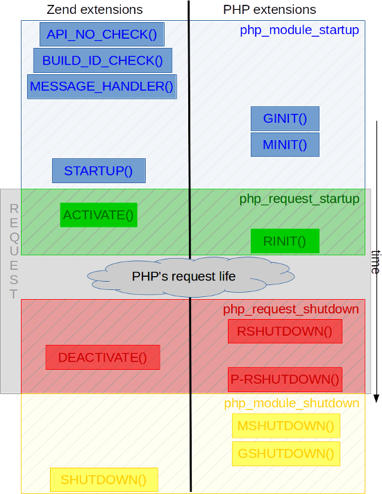

Zend Extensions
===============

PHP knows two kinds of extensions : 

* The PHP extensions, the most commonly used
* The Zend extensions, more uncommon, allows other hooks

This chapter will detail what are the main differences between Zend extensions and PHP extensions, when you should use 
one instead of the other, and how to build hybrid extensions, aka extensions being both PHP and Zend at the same time 
(and why do that).

On differences between PHP and Zend extensions
**********************************************

Just to say. Into PHP's source code, PHP extensions are named as **"PHP modules"**, whereas Zend extensions are called 
**"Zend extensions"**.

So into PHP's heart, if you read the "extension" keyword, you should first think about a Zend extension. And if you 
read the "module" keyword, you may think about a PHP extension.

In traditionnal life, we talk about *"PHP extensions"* versus *"Zend extensions"*.

The thing that differentiate them is the way they are loaded :

* PHP extensions (aka PHP "modules") are loaded in INI files as a *"extension=pib.so"* line
* Zend extensions are loaded in INI files as a *"zend_extension=pib.so"* line

That's the only visible difference we see from PHP userland.

But that's a different story from internal point of view.

What is a Zend extension ?
**************************

First of all, Zend extensions are compiled and loaded the same way as PHP extensions. Thus, if you haven't yet read the 
:doc:`building PHP extensions <../build_system/building_extensions>` chapter, you should have a look as it is valid 
also for Zend extensions.

.. note:: If not done, :doc:`get some informations about PHP extensions <../extensions_design>` as we will compare 
          against them here. Zend extensions share a very part of concepts with PHP extensions.

Here is a Zend extension. Note that you need to publish not one but two structures for the engine to load your Zend 
extension::

    /* Main Zend extension structure */
    struct _zend_extension {
        char *name;                                           /*
        char *version;                                         * Some infos
        char *author;                                          *
        char *URL;                                             *
        char *copyright;                                       */

        startup_func_t startup;                               /*
        shutdown_func_t shutdown;                              *  Specific branching lifetime points
        activate_func_t activate;                              *  ( Hooks )
        deactivate_func_t deactivate;                          */

        message_handler_func_t message_handler;               /* Hook called on zend_extension registration */

        op_array_handler_func_t op_array_handler;             /* Hook called just after Zend compilation */

        statement_handler_func_t statement_handler;           /*
        fcall_begin_handler_func_t fcall_begin_handler;        *  Hooks called through the Zend VM as specific OPCodes
        fcall_end_handler_func_t fcall_end_handler;            */

        op_array_ctor_func_t op_array_ctor;                   /* Hook called on OPArray construction */
        op_array_dtor_func_t op_array_dtor;                   /* Hook called on OPArray destruction */

        int (*api_no_check)(int api_no);                      /* Checks against zend_extension incompatibilities
        int (*build_id_check)(const char* build_id);           */
        
        op_array_persist_calc_func_t op_array_persist_calc;   /* Hooks called if the zend_extension extended the
        op_array_persist_func_t op_array_persist;              * OPArray structure and has some SHM data to declare
                                                               */

        void *reserved5;                                      /*
        void *reserved6;                                       * Do what you want with those free pointers
        void *reserved7;                                       *
        void *reserved8;                                       */

        DL_HANDLE handle;                                     /* dlopen() returned handle */
        int resource_number;                                  /* internal number used to manage that extension */
    };
    
    /* Structure used when the Zend extension gets loaded into the engine */
    typedef struct _zend_extension_version_info {
        int zend_extension_api_no;
        char *build_id;
    } zend_extension_version_info;

.. note:: As always, read the source. Zend extensions are managed into 
          `Zend/zend_extension.c <https://github.com/php/php-src/blob/57dba0e2f5e39f6b05031317048e39d463243cc3/Zend/
          zend_extensions.c>`_ (and .h)

Like you can notice, Zend extensions are more complex than PHP extensions, as they got more hooks, and those are much 
closer to the :doc:`Zend engine and its Virtual Machine <../zend_engine>` (The most complex parts of the whole PHP 
source code).

Why need a Zend extension ?
***************************

Let us warn you : until you have **very advanced** knowledge on PHP internal's Vritual Machine, and until you need to 
hook deep into it, you shouldn't need a Zend extension, but a PHP extension will be enough.

Today's most commonly known Zend extensions into PHP's world are OPCache, XDebug, phpdbg and Blackfire. But you know 
dozens of PHP extensions next to that don't you ?! That's a clear sign that :

* You should not need a Zend extension for a very big part of your problematics
* Zend extensions can also be used as PHP extensions (more on that later)
* A PHP extension still can do a lot of things.
* Usually, Zend extensions are needed for two kinds of tasks : debuggers and profilers.

.. note:: There is no :doc:`skeleton generator <extension_skeleton>` for Zend extensions, like for PHP extensions.

.. warning:: With Zend extensions, no generator, no help. Zend extensions are reserved to **advanced programmers**, 
             they are more complex to understand, they got deeper-engine behaviors and usually require an advanced 
             knowledge of PHP's internal machinery.

Basically, if you need to create a debugger, you'll need a Zend extension. For profilers, you can make some as 
traditionnal PHP extensions, that can work and that depends on your needs.

Also, if you need to master extensions loading order, Zend extensions will help (we'll see that).

Finally, if your goal is "just" to *add* some new concepts (functions, classes, constants, etc...) to PHP, you'll use a 
PHP extension, but if you need to *change* a current behavior of PHP, probably a Zend extension will be better.

We can't give rules here, but we can explain how all that stuff works, so that you get your own idea of the 
capabilities brought by Zend extension against PHP extension.

Also, you may create an *hybrid* extension, which is both a Zend extension *and* a PHP extension (this is tricky but 
perfectly valid and allows you to program in both "worlds" at the same time).

API versions and conflicts management
*************************************

You know that PHP extensions check against several rules before loading, to know if they are compatible with the PHP 
version you try to load them on. This has been detailed into 
:doc:`the chapter about building PHP extensions <../build_system/building_extensions>`.

For Zend extension, the same rules apply, but a little bit differently : Instead of the engine trashing you away in 
case of mismatch in numbers, it will use the ``zend_extension_version_info`` structure you published to know what to do.

The ``zend_extension_version_info`` structure you declare contain only two informations that the engine will use when 
you load your Zend extension :

* ``ZEND_EXTENSION_API_NO``
* ``ZEND_EXTENSION_BUILD_ID``

The ``ZEND_EXTENSION_API_NO`` is checked when your Zend extension is loaded. But the difference is that if this number 
doesn't match your Zend extension's, you still have a chance to get loaded. The engine will call for your 
``api_no_check()`` hook, if you declared one, and will pass it the current PHP runtime ``ZEND_EXTENSION_API_NO``. Here, 
you must tell if you support that API number, or not.

The same applies to the other ABI settings, such as ``ZEND_DEBUG``, or ``ZTS``. Where PHP extensions will refuse to 
load if there is a mismatch, Zend extensions are given a chance to load as the engine checks against 
``build_id_check()`` hook and pass it the ``ZEND_EXTENSION_BUILD_ID``. Here again, you say if you are compatible or not.

Remember that we detail how API and ABI is numbered, 
:doc:`in the chapter about building PHP extensions <../build_system/building_extensions>`.

Those abilities to force things against the engine are rarely used in practice.

.. note:: You see how more complex Zend extensions are compared to PHP extensions ? The engine is less restrictive, and 
          it suppose that you know what you do, for the best or the worst.
          
.. warning:: Zend extensions should really be developped by experienced and advanced programmers, as the engine is 
             weaker about its checks. It clearly supposes that you master what you do.

To sum things up about API compatibility, well, every step is detailed in 
`zend_load_extension() <https://github.com/php/php-src/blob/57dba0e2f5e39f6b05031317048e39d463243cc3/Zend/
zend_extensions.c#L67>`_.

Then comes the problem of Zend extension conflicts. One may be incompatible with an other, and to master that, every 
Zend extension has got a hook called ``message_handler``. If declared, this hook is triggered on every already loaded 
extension when another Zend extension gets loaded. You are passed a pointer to its ``zend_extension`` structure, and you 
may then detect which one it is, and abort if you think you'll confict with it. This is something rarely used in 
practice as well.

Zend extensions lifetime hooks
******************************

If you remember about :doc:`the PHP lifecycle <php_lifecycle>` (you should read the dedicated chapter), well, Zend 
extensions plug into that lifecycle this way:

   
We can notice that our ``api_no_check()``, ``build_id_check()`` and ``message_handler()`` check hooks are only triggered 
when PHP starts up. Those later three hooks are detailed in the preceding part (above).

Then the **important** thing to remember :

* ``MINIT()`` is triggered on PHP extensions **before** Zend extensions (``startup()``).
* ``RINIT()`` is triggered on Zend extensions (``activate()``) **before** PHP extensions.
* Zend extensions request shutdown procedure (``deactivate()``) is called **in between** ``RSHUTDOWN()`` and 
  ``PRSHUTDOWN()`` for PHP extensions.
* ``MSHUTDOWN()`` is called on PHP extensions **first**, then on Zend extensions **after** (``shutdown()``).

.. warning:: Like for every hook, there is a precise defined order and you must master it and remember it for complex 
             use-case extensions.

In *practice*, what we can say about it is that :

* Zend extensions are started **after** PHP extensions. That allows Zend extensions to be sure that every PHP extension 
  is already loaded when they start. They are then able to replace-and-hook into PHP extensions. For example, if you need 
  to replace the ``session_start()`` function handler by yours, it will be easier to do so in a Zend extension. If you do 
  it in a PHP extension, you must be sure you get loaded after the session extension, and that can be tricky to check and 
  to master (You still can specify a dependency using a `zend_module_dep <https://github.com/php/php-src/blob/
  c18ba686cdf2d937475eb3d5c239e4ef8e733fa6/Zend/zend_modules.h#L118>`_).
  However, :doc:`remember <extension_skeleton>` that statically compiled extensions are always started before 
  dynamically compiled ones. Thus, for the session use-case, this is not a problem as *ext/session* is loaded as static.
  Until some distributions (FreeBSD hear us) change that ...
  
* Zend extensions are triggered **before** PHP extensions when a request shows in. That means they got a chance to modify 
  the engine about the current request to come, so that PHP extensions use that modified context. OPCache uses such a 
  trick so that it can perform its complex tasks before any extension had a chance to prevent it to.
  
* Same for request shutdown : Zend extensions can assume every PHP extension has shut down the request.

Practice : my first example Zend extension
******************************************

Here we'll detail in practice some hooks Zend extensions can use, and what to do with them, in some very simple scenario.

.. warning:: Remember that Zend extension design usually require that you master the 
             :doc:`Zend engine <../zend_engine>` deeply.

For our example here, we're gonna design a Zend extension that uses those hooks :

* ``fcall_begin_handler`` : We'll detect what instructions are currently being executed by the VM, and print a message.
  The hook catches two things : a call to require/include/eval or a call to any function/method.
* ``op_array_handler`` : We'll detect what PHP function is currently being compiled, and print a message.
* ``message_handler`` : We'll detect other Zend extensions loaded, and print a message.

Here is then our skeleton, that we must write ourselves as for Zend extensions, there is no skeleton generator like for 
PHP extensions. The files are called *pib.c* and *php_pib.h* , the structure of the files stays the same as for PHP 
extensions, simply we won't declare in there the same things::

    #include "php.h"
    #include "Zend/zend_extensions.h"
    #include "php_pib.h"
    #include "Zend/zend_smart_str.h"

    /* Remember that we must declare such a symbol in a Zend extension. It is used to check
     * if it was built against the same API as the one PHP runtime uses */
    zend_extension_version_info extension_version_info = {
	    ZEND_EXTENSION_API_NO,
	    ZEND_EXTENSION_BUILD_ID
    };

    zend_extension zend_extension_entry = {
        "pib-zend-extension",
        "1.0",
        "PHPInternalsBook Authors",
        "http://www.phpinternalsbook.com",
        "Our Copyright",
        NULL,                               /* startup() : module startup */
        NULL,                               /* shutdown() : module shutdown */
        pib_zend_extension_activate,        /* activate() : request startup */
        pib_zend_extension_deactivate,      /* deactivate() : request shutdown */
        pib_zend_extension_message_handler, /* message_handler() */

        pib_zend_extension_op_array_handler,      /* compiler op_array_handler() */
        NULL,                                     /* VM statement_handler() */
        pib_zend_extension_fcall_begin_handler,   /* VM fcall_begin_handler() */
        NULL,                                     /* VM fcall_end_handler() */
        NULL,                                     /* compiler op_array_ctor() */
        NULL,                                     /* compiler op_array_dtor() */
        STANDARD_ZEND_EXTENSION_PROPERTIES        /* Structure-ending macro */
    };
    
    static void pib_zend_extension_activate(void) { }

    static void pib_zend_extension_deactivate(void) { }
    
    static void pib_zend_extension_message_handler(int code, void *ext) { }
    
    static void pib_zend_extension_op_array_handler(zend_op_array *op_array) { }
    
    static void pib_zend_extension_fcall_begin_handler(zend_execute_data *ex) { }

So far so good, this extension compiles as a zend extension, but does nothing. Not really nothing.
The first lines in the ``zend_extension`` structure appear in the ``phpinfo()``::

    This program makes use of the Zend Scripting Language Engine:
    Zend Engine v3.1.0, Copyright (c) 1998-2017 Zend Technologies
        with pib-zend-extension v1.0, Our Copyright, by PHPInternalsBook Authors

This is mandatory, the engine reacts like this : it prints the first ``zend_extension`` fields into engine 
informations, for every loaded Zend extension.

That's all for now. Let's fill-in those empty-body functions now::

    static void pib_zend_extension_message_handler(int code, void *ext)
    {
        php_printf("We just detected that zend_extension '%s' is trying to load\n", ((zend_extension *)ext)->name);
    }

Like said before, ``message_handler()`` is a special hook that Zend extensions may declare to be noticed when another 
Zend extension get loaded. Be carefull however of the order. You must register our "pib" Zend extension first, then 
another Zend extension (like OPCache) after that, as the ``message_handler()`` is only called when a Zend extension is 
loaded you obviously need to be loaded before to declare it. Chicken and egg.

Then we'll start to dive into the engine, with our ``op_array_handler`` hook::

    static void pib_zend_extension_op_array_handler(zend_op_array *op_array)
    {
        smart_str out = {0};

        smart_str_appends(&out, "We just compiled ");

        if (op_array->function_name) {
            uint32_t i, num_args = op_array->num_args;

            if (op_array->fn_flags & ZEND_ACC_CLOSURE) {
        	    smart_str_appends(&out, "a closure ");
            } else {
        	    smart_str_appends(&out, "function ");
        	    smart_str_append(&out, op_array->function_name);
            }
            smart_str_appendc(&out, '(');

            if (op_array->fn_flags & ZEND_ACC_VARIADIC) {
                num_args++;
            }
            for (i=0; i<num_args; i++) {
                zend_arg_info arg = op_array->arg_info[i];

                if (arg.class_name) {
                    smart_str_append(&out, arg.class_name);
                    smart_str_appendc(&out, ' ');
                }
                if (arg.pass_by_reference) {
                    smart_str_appendc(&out, '&');
                }
                if (arg.is_variadic) {
                    smart_str_appends(&out, "...");
                }
                smart_str_appendc(&out, '$');
                smart_str_append(&out, arg.name);
                if (i != num_args - 1) {
                    smart_str_appends(&out, ", ");
                }
            }

            smart_str_appends(&out, ") in file ");
            smart_str_append(&out, op_array->filename);
            smart_str_appends(&out, " between line ");
            smart_str_append_unsigned(&out, op_array->line_start);
            smart_str_appends(&out, " and line ");
            smart_str_append_unsigned(&out, op_array->line_end);
        } else {
            smart_str_appends(&out, "the file ");
            smart_str_append(&out, op_array->filename);
        }

        smart_str_0(&out);
        php_printf("%s\n", ZSTR_VAL(out.s));
        smart_str_free(&out);
    }

.. note:: Get some informations :doc:`about the Zend Engine <../zend_engine>` if you need.
   
This hook is triggered by the pass two of the compiler. When the Zend compiler fires in, it compiles a script or a 
function. Just before ending, it launches a second compiling pass which goal is to resolve unresolved pointers (which 
value couldn't be known while compiling the script). This is the ``pass_two()`` function 
`which source code <https://github.com/php/php-src/blob/81c2a4b9ba0816a0bda4f004aeca634ad8b58970/Zend/
zend_opcode.c#L577>`_ you can analyze.

In the ``pass_two()`` source code, you can see that it triggers the ``op_array_handler()`` of every registered Zend
extension so far, and it passes it as argument the current not-fully-resolved-yet OPArray. This is what we get as 
argument in our function. We then analyze it, and try to pull out some informations about it, like the 
currently-being-compiled function, its arguments informations etc...  Something very close to what the Reflection API 
does, we are just a little bit less accurate here, as the OPArray is not fully resolved, we are still part of the 
compilation step here. We could have gathered the default argument values f.e (which is not done here), but that would 
have added so much complexity to the example that we decided not to show such a part.
 
.. note:: Remember that :doc:`smart_str are detailed here <../internal_types/strings/smart_str>`, 
          :doc:`zvals here <../internal_types/zvals>`, :doc:`OPArrays here <../zend_engine/main_structures>`, etc...
 
Let's continue then ?::

    static void pib_zend_extension_activate(void)
    {
        CG(compiler_options) |= ZEND_COMPILE_EXTENDED_INFO;
    }

    static void pib_zend_extension_deactivate(void)
    {
        CG(compiler_options) &= ~ZEND_COMPILE_EXTENDED_INFO;
    }

    static void pib_zend_extension_fcall_begin_handler(zend_execute_data *execute_data)
    {
        if (!execute_data->call) {
            zend_op n = execute_data->func->op_array.opcodes[(execute_data->opline - execute_data->func->op_array.opcodes) + 1];
            if (n.extended_value == ZEND_EVAL) {
                php_printf("Begining of a code eval() in %s:%u", ZSTR_VAL(execute_data->func->op_array.filename), n.lineno);
            } else {
                zend_string *file = zval_get_string(EX_CONSTANT(n.op1));
                php_printf("Begining of an include of file '%s'", ZSTR_VAL(file));
                zend_string_release(file);
            }
        } else if (execute_data->call->func->common.fn_flags & ZEND_ACC_STATIC) {
            php_printf("Begining of a new static method call : '%s::%s'",
                        ZSTR_VAL(Z_CE(execute_data->call->This)->name),
                        ZSTR_VAL(execute_data->call->func->common.function_name));
        } else if (Z_TYPE(execute_data->call->This) == IS_OBJECT) {
            php_printf("Begining of a new method call : %s->%s",
                        ZSTR_VAL(Z_OBJCE(execute_data->call->This)->name),
                        ZSTR_VAL(execute_data->call->func->common.function_name));
        } else {
            php_printf("Begining of a new function call : %s", ZSTR_VAL(execute_data->call->func->common.function_name));
        }
        PHPWRITE("\n", 1);
    }

On request startup, we tell the compiler to generate some extended informations into the OPArray it's going to create. 
The flag for that is ``ZEND_COMPILE_EXTENDED_INFO``. Extended informations are VM OPCode hooks, that is the compiler 
will generate a special OPCode before every function is called, and after every function call is finished. Those are 
``FCALL_BEGIN`` and ``FCALL_END`` OPCodes.

Here is an exemple of a simple PHP function call OPCodes, with the 'foo' string as first solo argument:

.. code-block:: text

     L9    #1     INIT_FCALL              112                  "foo"                                    
     L9    #2     SEND_VAL                "foo"                1                                        
     L9    #3     DO_FCALL                                                                              
     L11   #4     RETURN                  1

Now the same once we told the compiler to generate additionnal OPCodes:

.. code-block:: text

     L9    #3     INIT_FCALL              112                  "foo"                                    
     L9    #4     EXT_FCALL_BEGIN                                                                       
     L9    #5     SEND_VAL                "foo"                1                                        
     L9    #6     DO_FCALL                                                                              
     L9    #7     EXT_FCALL_END                                                                         
     L11   #8     RETURN                  1                                             

Like you can see, the OPCodes about sending the argument and calling the function have been surrounded by two 
``EXT_FCALL_BEGIN`` and ``EXT_FCALL_END`` OPCodes, those two later will execute ``fcall_begin()`` and ``fcall_end()`` 
handlers of every declared Zend extensions, like ours.

Remember that a function call, into the engine, is whether a true function call, or the execution of a new included PHP 
file, or the execution of a new ``eval()`` block. Look at the ``require()`` disassembled:

.. code-block:: text

     L9    #3     EXT_FCALL_BEGIN                  
     L9    #4     INCLUDE_OR_EVAL         "foo.php"
     L9    #5     EXT_FCALL_END                    
     L11   #6     RETURN                  1   

Once those "marker" OPCodes have been generated, when the VM runs the OPArray OPCodes, it will run our ``fcall_begin()`` 
handler we declared. That's for us a way to detect what function/file/eval is going to be executed just next. We 
simply print such information.

.. note:: Asking the compiler to generate ``EXT_FCALL`` statements will slow down the executor a lot. About four times 
          slower to run the exact same code. ``EXT_FCALL`` should be used for debuggers only, or at least not for 
          production code as the Zend VM executor is much slower with them activated : this is more code to run for 
          every fcall/include/eval.

Hybrid extensions
*****************

What we call hybrid extensions, are extensions that are **both** Zend extensions, and PHP extensions.

How is that possible ? And what for ?.
