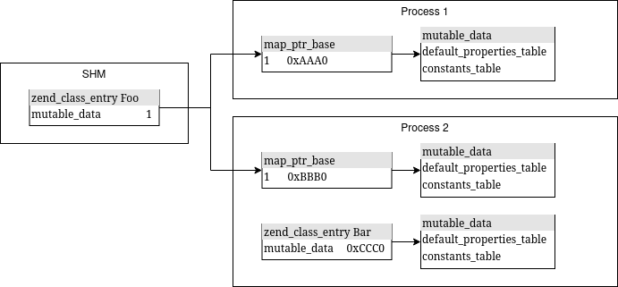

Zend Opcache
============

While PHP is an interpreter, it does not interpret PHP source code directly. Instead, the source code is first parsed
into an abstract syntax tree (AST), which is then compiled to opcodes (and used to generate classes and other data
structures), which are then passed to the Zend virtual machine (Zend VM) to actually be interpreted.

As you can see, there are quite a few steps involved to run a single PHP file. Without an additional extension, PHP
will perform all of these steps for every single loaded file in every single request. Since usually PHP files don't
change between requests both the parsing and compilation steps will always yield the same result. Opcache is an
extension that caches the opcodes and data structures like classes between requests to improve performance. The AST is
not used after the compilation step (with the exception of constant expressions) and thus does not need to be cached.

Normally, all the memory allocated during the processing of a request gets freed after the request has been processed.
So to store the compiled opcodes for future requests opcache puts them in a shared memory segment (SHM) that can not
only be accessed by the same process after the request has finished but also by other processes handling other requests.
This means that if you are using php-fpm with many children they will only store the opcodes for each PHP file once in
SHM. 

This comes with a significant restriction: The opcodes and other data structures in SHM must not be mutated by any
child request (at least not unless these changes should also affect the other processes). If any changes to SHM are
made there is a locking mechanism to avoid data races.

The classes and OParrays (arrays of opcodes, i.e. functions) in SHM are mostly immutable. There are currently the
following exceptions:

* ``zend_persistent_script.dynamic_members`` stores information about the state of the cached script
* ``zend_class_entry.inheritance_cache`` is extended if a new combination of parent class and interfaces is encountered
* ``zend_op.handler`` can be replaced at runtime by the tracing JIT to start executing JITted code
* ``zend_string.gc.refcount`` for persistent strings can be replaced with map ptr offset to cache class lookups by name

map_ptr
-------

As mentioned in the introduction, SHM is shared for all child processes. Thus, no changes can be made to the data
structures living in SHM unless 1. the changes are supposed to be reflected in all child processes and 2. the SHM
segment has been locked before any changes are written to avoid data races.

Sometimes the data structures contain a field that should be different per process or request. The ``map_ptr`` mechanism
can be used to achieve this. In short, instead of storing a pointer to per-process data directly (as that would affect
all processes but each having different addresses for this process specific data), a unique offset is assigned during
compilation. During runtime, local memory is allocated to hold enough space for all the entries referenced in these
offsets. Each offset then corresponds to an item in the local memory segment without needing to know the per-process
location of the exact element.

The map ptr can also store real pointers. This can be useful when the data structure doesn't live in SHM and thus
doesn't need to store the value in a separate map. The fact that pointers are aligned by their size is used to
differentiate between offsets and real pointers. The offsets start at 1, 9, 17, etc (assuming a 64-bit pointer size).
However, pointers (unless padding was removed) would not get aligned this way. Instead, they would be stored in
addresses that end with 0x0 or 0x8 given that they are 8-byte aligned. The macro ``ZEND_MAP_PTR_IS_OFFSET`` will be used
internally to check if the ``0b1`` byte is set. If it is, the value stored is an offset. Otherwise it's a direct
pointer.

Here is an example from php-src.

Classes can contain data that needs to be evaluated at runtime, called ``mutable_data``. This ``mutable_data`` contains
fields like ``default_properties_table``, ``constants_table`` and more.  ``ZEND_MAP_PTR_DEF`` can be used to declare a
field that holds the offset into local memory or direct pointer.

::

    struct _zend_class_entry {
        // ...
        ZEND_MAP_PTR_DEF(zend_class_mutable_data*, mutable_data);
        // ...
    };

``ZEND_MAP_PTR_INIT`` assigns a value directly to the underlying offset field. This must only be done when the structure
is not yet in SHM. In practice, this marco should usually only be used to initialize the map ptr to ``NULL``.

::

    ZEND_MAP_PTR_INIT(ce->mutable_data, NULL);

``ZEND_MAP_PTR_NEW`` can be used to generate a new offset and store it in the given field. This must only be done when
the structure is not yet in SHM. This step can be skipped if the data structure is not intended to be stored in SHM and
thus doesn't need any pointer indirection. 

::

    ZEND_MAP_PTR_NEW(ce->mutable_data);

To assign a pointer to the map ptr you can use the ``ZEND_MAP_PTR_SET`` macro. It will automatically store it in the
local map (through ``ZEND_MAP_PTR_SET_IMM``) or in the map ptr itself (through ``ZEND_MAP_PTR_INIT``) depending on
whether it contains an offset or a real pointer (or ``NULL``). ``ZEND_MAP_PTR_SET_IMM`` should usually not be called
directly as it assumes the underlying value is an offset, which is not a always a safe assumption.

::

    ZEND_MAP_PTR_SET(ce->mutable_data, mutable_data);

``ZEND_MAP_PTR_GET`` can be used to retrieve the pointer regardless of whether it's stored as an indirect of direct
pointer. Once again, there's ``ZEND_MAP_PTR_GET_IMM`` which usually shouldn't be called directly.

::

    zend_mutable_data *mutable_data = ZEND_MAP_PTR_GET(ce->mutable_data);

To summarize, with the map ptr mechanism the relative offset to ``mutable_data`` is the same for each process. The local
map itself lives at a different address in each process. The associated item will be retrieved by adding the given offset
to the base of the local map.
