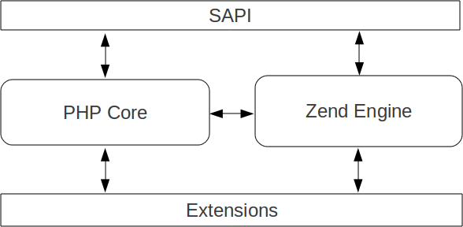

Introducting PHP
================

You know PHP, but perhaps should you know it from an external point of view, as a user. Our goal here, is to show you
PHP from an internal eye.
You should recall that PHP is a language designed for web programming, and as-is, PHP is also itself a program, written
in C, that very basically will open php files, read them, understand a syntax and execute what it understood to produce
a result.

How is PHP itself organised ? Let's start with some statistics about PHP's source code:

.. code-block:: none

    php5-5src/ > sloccount .
    
    SLOC	Directory	SLOC-by-Language (Sorted)
    687097  ext             ansic=613811,php=28746,sh=22977,xml=9843,cpp=8024,
                            exp=1623,pascal=886,python=519,awk=353,perl=315
    82863   Zend            ansic=79496,php=2025,yacc=1315,pascal=19,sh=8
    34938   sapi            ansic=33989,cpp=682,php=163,sh=104
    20056   main            ansic=20056
    5391    top_dir         php=3411,sh=1903,ansic=77
    3536    TSRM            ansic=3511,sh=25
    3326    win32           ansic=2905,php=421
    2433    scripts         php=2032,sh=353,awk=38,xml=10
    427     tests           php=423,pascal=2,sh=2
    75      netware         ansic=75
    59      pear            php=59

    Totals grouped by language (dominant language first):
    ansic:       753920 (88.78%)
    php:          37280 (4.39%)
    sh:           26940 (3.17%)
    xml:          17153 (2.02%)
    cpp:           8706 (1.03%)
    exp:           1623 (0.19%)
    yacc:          1315 (0.15%)
    pascal:         907 (0.11%)
    awk:            538 (0.06%)
    python:         519 (0.06%)
    perl:           315 (0.04%)
    
This output has been generated using David A. Wheeler's 'SLOCCount'. It basically analyzes a tree and tries to find
source files which it then parses to recognize the programming language used, and the number of source code lines.
What we can see here is that the whole PHP source code (based on the 5.5 source tree) is about 750.000 lines of C code.
Notice that the source contains as well about 37.000 of PHP, and a bunch of shell scripting lines. C lines represent
something like 89% of all the source code lines, so yes, better know the C language to keep on reading ;-)

Also, PHP is a multi-platform language, that means that you can compile it on many systems. This is a hard part in PHP
source code analysis. You'll very often see some decision points in its source code, based on the OS actually 
considered for compilation::

    /* Example taken from main/main.c */
    
    /* Windows and Netware use the internal mail */
    #if defined(PHP_WIN32) || defined(NETWARE)
    # define DEFAULT_SENDMAIL_PATH NULL
    #elif defined(PHP_PROG_SENDMAIL)
    # define DEFAULT_SENDMAIL_PATH PHP_PROG_SENDMAIL " -t -i "
    #else
    # define DEFAULT_SENDMAIL_PATH "/usr/sbin/sendmail -t -i"
    #endif
    
If you want to alter the source code or to develop new concepts in extensions, depending on your personnal use-case and
the way you'd like eventually to distribute your code, you will always have to deal with multi-platform code.
The biggest differences comes from Unix based systems against Microsoft systems. You should document yourself about
these concepts if you think you'll have to deal with them in the future.

So now you have all the source code under your eyes, it's time to split it into several conceptual parts. The next
chapter will teach you about source code organisation and noticeable components that make PHP.

.. toctree::
    :maxdepth: 2

    php_main/php_components.rst
    php_main/php_extensions_intro.rst
