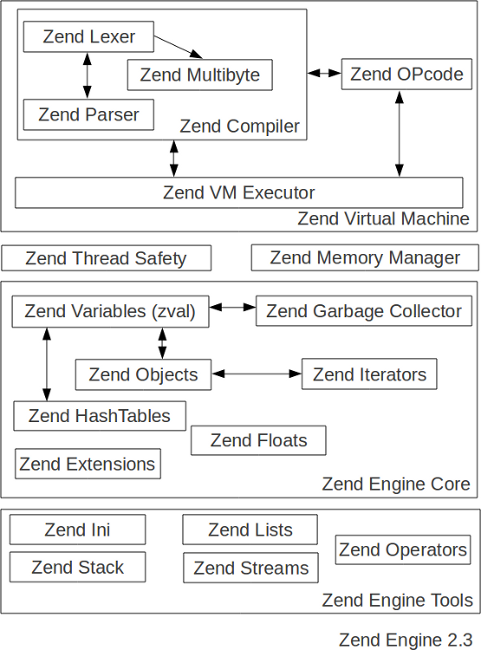

Decomposing PHP components
==========================

PHP source code can be divided into 4 depend layers (components) that you could study on an individual basis.
Each component depend on the others, so you cant separate them when you build PHP, but conceptually, those components
have a defined goal and when needing services from another component, they just call them using macros or functions.

PHP can be seen as the assembly of:

    * PHP Core
    * Zend Engine
    * SAPI
    * Extensions

With some effort, everything is possible, and companies such as IBM or FaceBook managed to trully separate those
layers and make them interchangeable. They are not by default though.

SAPI
----

The Server Application Programming Interface is the entry point to PHP. It should contain the C "main" function,
the first function to be called when the PHP program is started.
The goals of the SAPI are:

    * Read and parse some configuration and eventually some invocation arguments
    * Provide several callback functions (more about them following)
    * Start the engine
    * Read and parse the request, pass it to the engine
    * Read engine answer and send it back to the client

The most important goals of a SAPI are hidden back into the callbacks it has to provide in order to be able to start.
If we analyze the SAPI structure, we can guess those goals::

    struct _sapi_module_struct {
	    char *name;
	    char *pretty_name;

	    int (*startup)(struct _sapi_module_struct *sapi_module);
	    int (*shutdown)(struct _sapi_module_struct *sapi_module);

	    int (*activate)(TSRMLS_D);
	    int (*deactivate)(TSRMLS_D);

	    int (*ub_write)(const char *str, unsigned int str_length TSRMLS_DC);
	    void (*flush)(void *server_context);
	    struct stat *(*get_stat)(TSRMLS_D);
	    char *(*getenv)(char *name, size_t name_len TSRMLS_DC);

	    void (*sapi_error)(int type, const char *error_msg, ...);

	    int (*header_handler)(sapi_header_struct *sapi_header, sapi_header_op_enum op, sapi_headers_struct *sapi_headers TSRMLS_DC);
	    int (*send_headers)(sapi_headers_struct *sapi_headers TSRMLS_DC);
	    void (*send_header)(sapi_header_struct *sapi_header, void *server_context TSRMLS_DC);

	    int (*read_post)(char *buffer, uint count_bytes TSRMLS_DC);
	    char *(*read_cookies)(TSRMLS_D);

	    void (*register_server_variables)(zval *track_vars_array TSRMLS_DC);
	    void (*log_message)(char *message TSRMLS_DC);
	    double (*get_request_time)(TSRMLS_D);
	    void (*terminate_process)(TSRMLS_D);

	    char *php_ini_path_override;

	    void (*block_interruptions)(void);
	    void (*unblock_interruptions)(void);

	    void (*default_post_reader)(TSRMLS_D);
	    void (*treat_data)(int arg, char *str, zval *destArray TSRMLS_DC);
	    char *executable_location;

	    int php_ini_ignore;
	    int php_ini_ignore_cwd; /* don't look for php.ini in the current directory */

	    int (*get_fd)(int *fd TSRMLS_DC);

	    int (*force_http_10)(TSRMLS_D);

	    int (*get_target_uid)(uid_t * TSRMLS_DC);
	    int (*get_target_gid)(gid_t * TSRMLS_DC);

	    unsigned int (*input_filter)(int arg, char *var, char **val, unsigned int val_len, unsigned int *new_val_len TSRMLS_DC);

	    void (*ini_defaults)(HashTable *configuration_hash);
	    int phpinfo_as_text;

	    char *ini_entries;
	    const zend_function_entry *additional_functions;
	    unsigned int (*input_filter_init)(TSRMLS_D);
    };

As you can see, it's far from beeing tiny, but the function pointers are self-explanatory. Basically, the important
thing about SAPI is that it is responsable of reading and parsing the request: the headers, cookies, and POST data.
At the other side, the SAPI should also provide functions to write some output (buffered or not), display errors,
log messages... Output buffering is tied to the SAPI output functions.

All those behaviors are really different when you talk about the two main modes PHP can run against: Web or not.
In "web mode", PHP is bound to a server, should it be internally using a so-called "server module", or externally
talking to the server throught CGI.
In "non web mode", PHP is bound to another layer, usually a shell, and things such as "request headers" are senseless
in such a mode.

As a quick example, let's foresee the "log_message" callback, from two different SAPI: CLI and Apache2 (apxs2)::

    /* log_message from CLI SAPI : */
    static void sapi_cli_log_message(char *message TSRMLS_DC) /* {{{ */
    {
	    fprintf(stderr, "%s\n", message);
    }

    /* log_message from apxs2 SAPI : */
    static void php_apache_sapi_log_message(char *msg TSRMLS_DC)
    {
	    php_struct *ctx;

	    ctx = SG(server_context);

	    if (ctx == NULL) { /* we haven't initialized our ctx yet, oh well */
		    ap_log_error(APLOG_MARK, APLOG_ERR | APLOG_STARTUP, 0, NULL, "%s", msg);
	    } else {
		    ap_log_rerror(APLOG_MARK, APLOG_ERR, 0, ctx->r, "%s", msg);
	    }
    }

As you can see from the code snippets above, the *log_message* handler on CLI SAPI just writes the message to *stderr*,
whereas when using Apache, it proxies the message to the Apache API, using its ``ap_log_error()`` function.

.. note::

    As you would have guessed, the SAPI "log_message" handler has nothing to do with PHP's logging capacities, those
    are two different concepts.

Also, if you develop server module to embed PHP into a webserver, they usually behave very differently from each other.
That's why, even beeing "web mode" SAPI, the Apache SAPI is very different from the Caudium SAPI for example.

The "embed" SAPI is meant to bind PHP into another C program. It publishes entry point to be able to
use the PHP and Zend API into C programs, binding them to libphp5.so

One interesting use of SAPI is the excellent `"PHPDbg" <http://phpdbg.com>`_ which implements a full command line based
debugging environment for PHP scripts.

PHP Core
--------

"PHP Core" is a designation meant to represent the PHP parts not beeing the engine. Yes, that seems a little bit
awkward definition, but as soon as you'll have some more understandings about it, you'll see by yourself that the
border between what is "php" and what is "zend" is very thin.

Quickly, PHP Core encompass the followings:

    * Network and files managing : PHP stream layer
    * Sorting algorithms, such as MergeSort
    * Parsing command line arguments (``getopt()``)
    * Parsing and normalizing paths and urls
    * Output buffering layer
    * ticks
    * Default functionnalities, such as a default POST reader for the SAPI layer
    * Error handling
    * global variables
    * string management functions

Here is the ``php_core_globals`` struct, it is filled once PHP has started, and it is available in every PHP point
after initialization (including extensions), using the special ``PG()`` macro::

    struct _php_core_globals {
        zend_bool implicit_flush;

        long output_buffering;

        zend_bool sql_safe_mode;
        zend_bool enable_dl;

        char *output_handler;

        char *unserialize_callback_func;
        long serialize_precision;

        long memory_limit;
        long max_input_time;

        zend_bool track_errors;
        zend_bool display_errors;
        zend_bool display_startup_errors;
        zend_bool log_errors;
        long      log_errors_max_len;
        zend_bool ignore_repeated_errors;
        zend_bool ignore_repeated_source;
        zend_bool report_memleaks;
        char *error_log;

        char *doc_root;
        char *user_dir;
        char *include_path;
        char *open_basedir;
        char *extension_dir;
        char *php_binary;
        char *sys_temp_dir;

        char *upload_tmp_dir;
        long upload_max_filesize;

        char *error_append_string;
        char *error_prepend_string;

        char *auto_prepend_file;
        char *auto_append_file;

        arg_separators arg_separator;

        char *variables_order;

        HashTable rfc1867_protected_variables;

        short connection_status;
        short ignore_user_abort;

        unsigned char header_is_being_sent;

        zend_llist tick_functions;

        zval *http_globals[6];

        zend_bool expose_php;

        zend_bool register_argc_argv;
        zend_bool auto_globals_jit;

        char *docref_root;
        char *docref_ext;

        zend_bool html_errors;
        zend_bool xmlrpc_errors;

        long xmlrpc_error_number;

        zend_bool activated_auto_globals[8];

        zend_bool modules_activated;
        zend_bool file_uploads;
        zend_bool during_request_startup;
        zend_bool allow_url_fopen;
        zend_bool enable_post_data_reading;
        zend_bool always_populate_raw_post_data;
        zend_bool report_zend_debug;

        int last_error_type;
        char *last_error_message;
        char *last_error_file;
        int  last_error_lineno;

        char *disable_functions;
        char *disable_classes;
        zend_bool allow_url_include;
        zend_bool exit_on_timeout;
    #ifdef PHP_WIN32
        zend_bool com_initialized;
    #endif
        long max_input_nesting_level;
        long max_input_vars;
        zend_bool in_user_include;

        char *user_ini_filename;
        long user_ini_cache_ttl;

        char *request_order;

        zend_bool mail_x_header;
        char *mail_log;

        zend_bool in_error_log;

    #ifdef PHP_WIN32
        zend_bool windows_show_crt_warning;
    #endif
    };

Zend Engine
-----------

The engine is an easilly recognizable part, as all its sources are contained in the ``Zend/`` subdirectory of PHP source,
and all its functions start with the prefix ``zend_``. It is also noticeable that the engine has its own config.m4
file and thus, is an autonomous entity that just gets included into PHP building process when you compile PHP.
It shares the same source tree though, and is not separated into another git tree, but the karma system for PHP
contribution give separate rights to commiting into PHP source or ZendEngine source.
You should also note that the Zend Engine has another licence than PHP itself, though both are fully compatible and
are BSD-style licences.

.. note::
    The PHP licence details may be obtained at http://www.php.net/license/
    The Zend Engine licence details may be obtained at http://www.zend.com/license/2_00.txt

The PHP designers separated the engine from the core to make it possible to grow and evolve it independantly, and to let
people change the PHP engine by building their own.

The engine parts mainly concern:

    * PHP variable definition (zval), type management and garbage collector (zend_gc)
    * PHP Arrays (hashtables) and PHP Objects and iterators
    * Memory manager
    * Low level definition of PHP classes and PHP functions
    * Extensions engine
    * High level C structures : Hashtables, linked lists, heaps, stacks, etc...
    * Advanced C float type management
    * Error and Exception handlers
    * Signal managers and thread safety basic concepts
    * Compiler and executor

If you look closer at its source, you'll notice that the engine itself can be seen as a set of components. Figure
below details the view:

The engine, and more precisely the virtual machine, is fully detailed in {{link here}}

Extensions
----------

The last part we have to talk about when having a first glance at PHP source are extensions. You notice an ``ext/``
subdirectory while browsing the sources. Extensions are a way to add features to PHP while implementing a simple
API which provides all hooks and tools to register new features into the language.

.. note::

    If you want to know more about how to compile extensions, or about PECL, then you should read
    :doc:`../build_system/building_extensions`

Extensions can be built statically or dynamically, in such a case they may be enabled using php.ini directives, so that
is very flexible and don't force you to rebuild PHP to add or remove extensions. More on that part can be read in
:doc:`../build_system/building_extensions`.

Some extensions, however, cannot be disabled, they are forced compiled statically, and as such, one could just not
notice this important fact. Did you know that array features for PHP are provided by an extension? Yes they are!
In PHP, lots of things are extensions, and actually the mandatory extension called ``standard`` provides PHP with
features about arrays, strings, serialisation, file handling etc...

Another important extension is named ``core``, it brings some Zend Engine user features into PHP. PHP functions such as
``func_num_args()`` or ``gc_enable()`` come from this extension.
Talking about mandatory extensions, we could add *ext/spl*, *ext/pcre*, *ext/ereg*, *ext/date* and *ext/reflection* to
the list. Disabling those in not an option, they are extensions, because when it comes to add functions, classes or ini
settings to PHP, extensions are just the place to store such code for such features.

Remember that you can see which extensions are loaded into PHP, just by displaying a ``phpinfo()`` page, or by using
features such as ``Reflection`` or ``get_loaded_extensions()``.

.. note::

    To shorten things, nearly everything is possible using extensions or zend extensions. It should be extremely rare
    you need to patch directly the PHP source code. Sure, there exists some things you really cant implement into an
    extension, such as changing the lexer, the parser or the compiler. Every thing else should be feasible using an
    extension.
